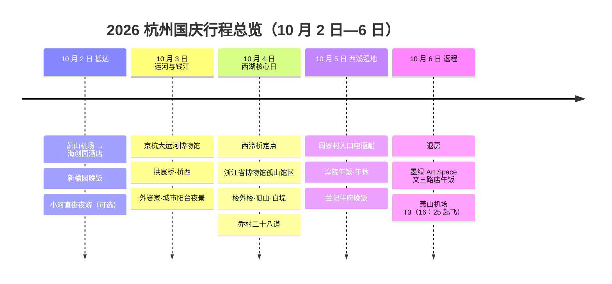

# 杭州国庆旅行方案总览

> 时间：2026 年 10 月 2 日 15:00 抵达杭州，10 月 6 日 16:25 从萧山机场 T3 起飞（4 晚、3 个完整游玩日）  
> 住宿：杭州未来科技城海创园地铁站桔子水晶酒店（2025 年开业）；公开平台显示余杭区五常街道岸汀街 980 号 6 幢，最终以订单定位为准  
> 同行情况：杭州当地全程共 3 名成人＋1 名老人，其中 1 名成人已经在杭州；乘飞机抵达并需要准备行李的是 2 名成人＋1 名老人。按无托运行李、只有极简随身行李规划；老人连续步行最多 60 分钟，优先少换乘、少久站并及时坐下休息  
> 最近核验：2026 年 9 月 5 日；浙江省博物馆孤山馆区当前已确认恢复常态开放，2026 国庆专项交通和场馆公告仍待发布

## 文档导航

- **主文档（本文）**：行程、时间、地点、交通规则、天气、行李与行前准备，全文不出现具体金额。
- 关联文档：
  - [交通方案分册](traffic.md)：纯打车、租车自驾、公共交通三套完整逐日方案，含 GeoJSON 地图与 Mermaid 动线图。
  - [预算分册](budget.md)：总预算、交通与餐饮费用、门票船票、核价清单及全部价格依据。

- [1. 总体建议](index.md#1-总体建议)
- [2. 三套独立方案对比](index.md#2-三套独立方案对比)
- [3. 一页执行卡](index.md#3-一页执行卡)
- [4. 地点速查](index.md#4-地点速查)
- [5. 关键行程判断](index.md#5-关键行程判断)
- [6. 出发前清单](index.md#6-出发前清单)
- [7. 出行总控](index.md#7-出行总控)
- [8. 三套交通方案（明细在独立分册）](traffic.md)
- [附录 A：餐饮、地点、天气与交通核验](index.md#附录-a餐饮地点天气与交通核验)
- [附录 C：References——数据来源与复现说明](index.md#附录-creferences数据来源与复现说明)

## 1. 总体建议

如果选择打车或公共交通，就完全不需要租车。本次景点全部在杭州市内，综合老人同行和国庆管控，**纯打车是当前首选**。

三种方案的成本测算、逐日里程、餐饮和门票船票预算统一整理在《[预算分册](budget.md)》中；本主文档只安排行程，不出现具体金额。

市内游览为 4 人，机场抵达段为 2 名成人＋1 名老人且只有极简随身行李；普通五座网约车在座位数和后备厢空间上通常够用，无需仅为行李升级六座车。老人优先时选打车；若酒店停车方便、希望随时回车内休息，也可以选自驾。两种方案的成本差距不大，取舍依据见《[预算分册](budget.md#5-三套方案成本对比)》。自驾 10 月 4 日仍默认停外围换乘，不把车辆开进孤山作为主方案。

## 2. 三套独立方案对比

> [!NOTE]
> 三套方案均保留完整的逐日行程、餐厅、返程和风险说明，彼此不依赖。实际出行时只需打开选中的那一套，不必来回查阅其他方案。

| 对比项 | [纯打车](traffic.md#8-纯打车方案首选) | [租车自驾](traffic.md#9-纯自驾方案租车) | [纯公共交通](traffic.md#10-纯公共交通方案) |
|---|---|---|---|
| 是否租车 | 否 | 是 | 否 |
| 老人友好度 | **最高**：上下车方便、换乘少 | 较高：可随时回车休息，但停车点到景点仍需步行 | 较低：换乘、站内步行和久站较多 |
| 国庆主要风险 | 西湖、城市阳台散场时叫车慢 | 西湖单双号、停车饱和、取还车耗时 | 地铁拥挤、换乘和末班车约束 |
| 10 月 4 日西湖 | 到西泠桥等官方定点上下客，稳定性最好 | 不论尾号均建议外围停车换乘；偶数尾号也不承诺开到孤山 | 地铁/公交加步行，最耗体力 |
| 10 月 6 日返程 | 墨绿午饭后直接叫车到 T3 | 午饭后还要加油、验车、摆渡，时间最紧 | 文三路站乘 19 号线直达机场，时间较稳定 |
| 适合谁 | 老人舒适和省心优先 | 有合适驾驶人、酒店免费停车且重视车内休息 | 预算优先、老人腿脚状态很好 |
| 当前排序 | **1，首选** | **2，可选** | **3，兜底** |

### 2.1 地图与动线图查看说明

后文每套方案都独立包含两种图，不需要引用其他方案：

- **GeoJSON 地理位置图**：按真实经纬度表示各地点的相对位置，并用五种颜色连接 10 月 2—6 日的主要动线。GitHub 可直接渲染和缩放；若本地阅读器只显示代码，点击图下方的 geojson.io 链接即可交互查看。
- **Mermaid 动线图**：突出每天的先后顺序、交通方式和可取消分支。GitHub及新版 VS Code 的 Markdown 预览可直接渲染。

| 地图颜色 | 对应日期 |
|---|---|
| 紫色 | 10 月 2 日，抵达、入住与可选夜游 |
| 橙色 | 10 月 3 日，大运河与城市阳台 |
| 蓝色 | 10 月 4 日，孤山馆区与西湖北线 |
| 绿色 | 10 月 5 日，西溪湿地与城西用餐 |
| 红色 | 10 月 6 日，文三路午饭与返程 |
| 深灰色点位 | 机场、酒店、景点、餐厅或换乘锚点 |

坐标统一采用 WGS84/CRS84，书写顺序是“经度、纬度”。景点使用具体 POI；公开地图未单独收录的个别餐厅，按已经核对过的地址锚定到所在建筑或街区，并在点名中明确标为“锚点”。彩色连线是帮助理解相对方位的简化直线，不是沿道路绘制的导航路线；出发时仍以高德、百度等实时导航为准。

### 2.2 五天总览时间轴

## 3. 一页执行卡

> [!TIP]
> 默认采用纯打车方案。这里只放当天真正需要记住的时间点；地址、替代方案和依据仍看后文。

| 日期 | 当天主线 | 关键时间 | 硬停止条件 |
|---|---|---|---|
| 10 月 2 日 | 机场 → 酒店 → 新榆园；状态好再去小河直街 | 15:00 落地；17:30 左右入住；19:00 前吃完才执行夜游；21:15 返程 | 17:30 后才入住、19:00 后才吃完、明显降雨或老人疲劳，立即取消夜游 |
| 10 月 3 日 | 大运河博物馆、拱宸桥、桥西 → 万象城 → 城市阳台 | 08:15 出发；09:30—11:30 博物馆；11:30 午饭；17:00 晚饭 | 江边遇中到大雨、强风或拥挤失控，晚饭后留在万象城 |
| 10 月 4 日 | 孤山馆区 → 楼外楼 → 孤山、西泠印社、平湖秋月、白堤精华段 → 乔村 | 09:00 左右入馆；11:30 午饭；12:30—15:30 西湖；17:00 晚饭 | 每走 45—60 分钟休息；到平湖秋月后体力不足就结束，不硬走断桥 |
| 10 月 5 日 | 周家村入口 → 西溪电瓶船 → 淳院 → 酒店午休 → 兰记牛府 | 07:45 出发；08:45—11:30 西溪；12:30—13:00 午饭；18:30 晚饭 | 雷暴、强风、停航或无船票时取消船线，只做入口附近短游 |
| 10 月 6 日 | 退房 → 墨绿文三路店 → 萧山机场 T3 | 10:00 前退房；11:00—11:50 午饭；12:00 必须离开；最迟 13:25 到 T3 | 11:00 不能入座或不能保证 40 分钟出餐，直接改快餐或机场用餐 |

## 4. 地点速查

| 类别 | 地点 | 导航地址或关键词 |
|---|---|---|
| 住宿 | 杭州未来科技城海创园地铁站桔子水晶酒店（2025 年开业） | 余杭区五常街道岸汀街 980 号 6 幢；以订单页定位为最终依据 |
| 机场 | 杭州萧山国际机场 T3 | 10 月 6 日 16:25 起飞；打车、导航和还车摆渡均以 T3 为终点 |
| 运河夜游 | 小河直街历史文化街区 | 拱墅区小河直街 51 号 |
| 大运河 | 中国京杭大运河博物馆 | 拱墅区金华路 34 号、运河文化广场 1 号 |
| 大运河 | 拱宸桥、桥西历史文化街区 | 拱墅区桥弄街；桥西入口在小河路与桥弄街交叉口东侧 |
| 钱塘江 | 杭州城市阳台 | 上城区解放东路与之江路交叉口 |
| 西湖 | 浙江省博物馆孤山馆区 | 西湖区孤山路 25 号 |
| 西湖 | 楼外楼、西泠印社 | 西湖区孤山路 30 号、31 号 |
| 餐厅 | 乔村二十八道（天目山路店） | 西湖区古天巷 8 号、天目里一带；国庆营业时间须再次确认 |
| 西溪 | 西溪湿地周家村入口 | 西湖区天目山路 518 号 |
| 餐厅 | 墨绿 Art Space（文三路店） | 用户确认在文三路；公开搜索尚未取得可靠门牌号，最终以用户收藏或订位页定位为准，勿误选转塘同名店 |

餐厅和交通换乘点的完整地址见[地点核验表](#a1-景点与交通点位)。

## 5. 关键行程判断

### 5.1 10 月 2 日夜游是否执行

这个想法可行，而且小河直街本身就是大运河沿线，不应再把“大运河”和“小河直街”当成两个相距很远的夜间项目。

仅在以下条件全部满足时执行：

- 17:30 前完成入住；
- 19:00 前吃完晚饭；
- 航班没有明显延误，老人精神和腿脚状态良好；
- 没有中到大雨。

建议 19:00 左右出发，20:00—21:15 只逛小河直街及运河边亮灯段，随后返回酒店。博物馆、拱宸桥和桥西留到 10 月 3 日白天。若入住较晚或老人疲劳，当晚直接休息，不影响后续核心行程。

### 5.2 为什么把灵隐改成可选项

原方案把“灵隐寺＋孤山馆区＋西湖北线”塞在同一天，对老人偏重。国庆期间灵隐还涉及外围换乘和排队，因此正式主线取消灵隐，保证用户点名的大运河、西溪、孤山馆区、钱塘江和城市阳台都能舒服完成。

这里取消的是灵隐，不是西湖。10 月 4 日从上午到下午都在西湖核心区域：孤山馆区只是第一站，后面继续游览孤山、西泠印社、平湖秋月和白堤。老人状态允许时，可在进入孤山前增加曲院风荷 30—45 分钟；如增加曲院风荷，就缩短白堤步行，不延长总步行量。

如果灵隐是必去项，可在 10 月 4 日 05:45 出发，上午灵隐、下午孤山馆区，但必须删除白堤长走和游船；具体替换办法已写入打车、自驾方案。

### 5.3 国庆必须知道的交通规则

现行官方长期方案把国庆定义为“长假”：

- 每天 08:00—17:00，西湖景区全域小客车实行“单日单号、双日双号”，新能源、临时号牌和非浙 A 车也包括在内。
- 10 月 4 日是双日；若租车车牌尾号为奇数，08:00—17:00 不能驶入限行区域。
- 灵隐区域及南山路部分区域在单双号之外，还实行“限量通行”，自驾须至少提前一天申领“西湖通”；每车每自然月限一次。
- 国庆每天 08:00—17:00，出租车和网约车不能直接进入灵隐及南山路限量区域，需要在官方点位换乘接驳车。
- 2026 年国庆仍可能发布临时加码措施，出发前必须再次核对，不把往年规则当成最终公告。

对本行程最重要的实际结论：**城市阳台不属于西湖景区限行区，打车、自驾原则上都能到钱江新城周边；孤山属于西湖单双号区，但不属于灵隐、南山路额外限量区。** 因此 10 月 4 日打车可到西泠桥等官方定点，自驾只有偶数尾号可在 08:00—17:00 通行，而且仍建议外围停车换乘。完整判断见[西湖与城市阳台到达 Review](#a6-西湖与城市阳台到达-review)。

### 5.4 天气、穿衣与人流原则

- 截至 2026 年 9 月 5 日，已经可以取得今年 10 月 2—6 日的季节集合预报：当前中位趋势为白天约 26.7—27.1℃、早晨约 16.6—17.6℃，整体偏舒适至微热；约 10—90 百分位仍覆盖最低约 12.5℃、最高约 30.5℃，暂时不能当作逐日天气预报。
- 2021—2025 年同期历史数据表明，杭州 10 月 2—6 日并不稳定：日最高温曾低至 18.7℃、高至 37.7℃，日最低温曾低至 13.9℃；不能只按“典型 15—25℃秋装”准备。
- 默认穿法采用分层：短袖或速干打底＋薄长袖/衬衫＋轻薄防风外套，下装以轻薄长裤为主。老人另带一件薄针织衫或轻抓绒，但目前没有必要直接带厚冬装。
- 必带防滑透气步行鞋、备用袜、遮阳帽、防晒用品和轻便雨具。西湖、西溪、运河及钱塘江边风感更明显，外套随身而不是留在酒店。
- 9 月 24—25 日看第一版趋势，9 月 29—30 日再确认逐小时降雨、气温和风力。
- 10 月 2—4 日通常是客流高峰；博物馆安排开门时段，正餐分别提前到 11:00—11:30 和 17:00 左右。
- 老人每段连续步行控制在 60 分钟以内，随后至少坐下休息 20—30 分钟。西湖不走全环线，西溪使用电瓶船。

### 5.5 2026 年 9 月 5 日整体复核结论

#### 5.5.1 已经成立的部分

- 10 月 2 日 15:00 落地后只安排入住、晚饭和可取消的小河直街，不影响后续核心景点。
- 10 月 3 日大运河与钱江新城虽然跨城，但中间在万象城安排了较长休息，强度可控。
- 10 月 4 日已明确为完整的西湖核心日，不是只看孤山馆区；路线覆盖孤山、西泠印社、平湖秋月和白堤精华段。
- 10 月 5 日单独留给西溪湿地，电瓶船为主，符合老人连续步行不超过 60 分钟的要求。
- 10 月 6 日加入墨绿 Art Space 文三路店后，打车和地铁均以 12:45—13:10 到达 T3 为目标；文三路站可直接乘 19 号线到机场。自驾还要还车，必须更早吃完。

#### 5.5.2 仍需在出发前闭环的风险

1. **孤山馆区国庆开放时段**：浙江省博物馆 2026-08-26 官方公告已确认孤山馆区自 9 月 1 日恢复常态开放，周二至周日 09:00 开馆、16:30 停止入馆、17:00 闭馆；10 月 4 日为周日，按常态规则可参观。法定节假日如有专门开放或预约安排仍会另行通知，9 月下旬只需复核国庆专项公告，不再把“疑似暂停”当作当前状态。
2. **2026 国庆专项交通公告**：长期单双号和“西湖通”规则已经明确，但当年是否增加整体预约、临时封路和停车换乘点，仍要等节前公告。
3. **租车报价构成**：取车前确认报价是否含基础保障、服务费、机场门店费和第二驾驶人，以及酒店四晚停车如何收费；核对清单见《[预算分册](budget.md#6-出发前价格核验与订单确认)》。
4. **网约车实时价格**：任何预算都不是平台锁价。9 月 29—30 日应按《[预算分册](budget.md)》中的五个日合计区间，在滴滴或高德逐段截图核价。
5. **预约和餐厅**：博物馆、西溪船票及重点餐厅的国庆预约尚需按各自开放时间操作；订不到楼外楼时不排队超过 30 分钟。乔村二十八道营业时间存在冲突；墨绿 Art Space 文三路店的准确门牌、10 月 6 日开餐时间也必须再次确认。

## 6. 出发前清单

### 6.1 已由本文完成

- [x] 三套交通方案分别保留完整行程、餐厅、返程和风险说明，互不依赖。
- [x] 核对主要地点地址，并用 WGS84 坐标制作三张独立 GeoJSON 地图和三张 Mermaid 动线图。
- [x] 按四人估算餐饮、景点、打车、自驾和公共交通预算，并记录依据与不确定项。
- [x] 根据老人连续步行不超过 60 分钟的要求设置取消条件、休息规则和西湖步行分段。
- [x] 核对现行西湖长期交通规则、孤山馆区当前开放状态、历史同期天气和当前远期趋势。
- [x] 增加地图颜色图例、最终确认表和通用应急卡。

### 6.2 待你或同行完成（TODO）

- [ ] **现在完成｜航班**：从订单页补齐往返航班号、航空公司、出发机场/航站楼；在航空公司 App 核对值机截止时间，以及随身包、20 寸箱和充电宝的尺寸/重量/容量限制。当前仅知道 10 月 2 日 15:00 落地、10 月 6 日 16:25 从萧山 T3 起飞，没有航班号就无法可靠核对这些规则。
- [ ] **现在完成｜酒店**：用订单确认是否确为“余杭区五常街道岸汀街 980 号 6 幢”的桔子水晶，并把酒店电话填入应急卡；避免与三维智汇中心附近同品牌酒店混淆。
- [ ] **9 月 20—24 日｜官方公告**：让助手或同行者重新检索杭州交警、浙江省博物馆、西溪湿地、中国京杭大运河博物馆的 2026 国庆公告。本文截至 9 月 5 日仍未取得可替代长期规则的国庆专项交通公告。
- [ ] **各平台放票当天｜实名预约**：由持有四人姓名、身份证件和手机号的同行者预约孤山馆区、需要预约的大运河场馆及西溪门票/电瓶船；完成后把日期、时段、入口和预约码写入 7.6 表格。助手可以核对规则，但不能代替本人完成实名验证或支付。
- [ ] **9 月 25—28 日｜餐厅订位**：电话或平台确认楼外楼、新榆园、乔村二十八道、墨绿；记录准确分店、时间、四人桌、靠背座椅、少台阶/电梯、取消规则及能否提前点菜。餐厅对座位与国庆营业的实时承诺必须以门店回复为准。
- [ ] **9 月 25—28 日｜墨绿定位**：从个人收藏或订位页补齐墨绿 Art Space 文三路店的门牌和电话，确认 10 月 6 日 11:00 可入座、40 分钟左右能出餐；勿误选转塘同名店。
- [ ] **若选择自驾｜租车订单**：确认租车报价是否包含基础保障、服务费、机场门店费和第二驾驶人，确认取还车位置、摆渡时间、车牌尾号及酒店四晚停车如何收费；把结果写入 7.6。核对项见《[预算分册](budget.md#6-出发前价格核验与订单确认)》。
- [ ] **9 月 29—30 日｜天气与交通终检**：让助手或同行者查看逐小时降雨、气温、风力、台风影响、2026 国庆交通临时措施和网约车逐段估价，据此决定鞋服、10 月 2 日夜游及最终交通方案。现在的季节预报不能代替临近预报。
- [ ] **出发前｜老人信息**：由家属填写应急联系人、既往病史、过敏史、常用药名称/剂量/服药时间；准备药物原包装、身份证件、防滑鞋、雨具和折叠手杖凳。当前不默认携带轮椅，按 7.4.3 的触发条件决定是否请杭州当地同行者安排短租。
- [ ] **9 月 25—30 日｜轮椅备选核实**：向孤山馆区、大运河博物馆和西溪周家村游客中心确认是否有免费轮椅、数量、押证/押金、是否预约、能否离开馆区及是否必须原处归还；国庆现场数量不能预留时，不把免费轮椅当作行程成立的前提。
- [ ] **10 月 1 日｜离线留档**：把酒店、航班、预约码、餐厅、租车/叫车信息截图离线保存，将本行程与应急卡发给至少一名同行者；确认四人移动支付可用并准备少量现金。

### 6.3 五天四晚极简行李清单

> 本清单只计算乘飞机抵达的 **2 名成人＋1 名老人**；另一名成人已经在杭州，不需要为其准备行李。酒店可以洗衣，因此按每晚清洗、次日或隔日轮换设计。目标是不托运、不等待行李转盘，并让老人空手。三人建议合计使用 **1 个符合航司限制的 20 寸登机箱＋1 个 10—15 L 随身包**；能否携带及重量上限必须在补齐航班号后按航空公司订单核对。充电宝和常用药放随身包，不能放入托运行李。

#### 6.3.1 出发当天每人直接穿

- 1 件透气短袖或速干上衣。
- 1 条轻薄长裤；不穿紧身牛仔裤或需要反复整理的长裙走景区。
- 1 双已经磨合好的防滑步行鞋；全程只带这一双鞋。
- 1 件可压缩的轻薄防风外套，机场空调、江边、船上和早晚直接使用。

#### 6.3.2 每人装进行李的衣物

| 衣物 | 极简数量 | 使用方法 |
|---|---:|---|
| 速干短袖 | 1 件 | 加上身上 1 件共 2 件；每晚清洗一件、轮换穿 |
| 薄长袖或衬衫 | 1 件 | 早晚单穿，也可叠在短袖外；同时作为短袖未干时的备用上衣 |
| 轻薄长裤 | 1 条 | 加上身上 1 条共 2 条，轮换穿 |
| 内衣 | 2 套 | 加上身上 1 套共 3 套；每日清洗，保留一套干燥备用 |
| 袜子 | 2 双 | 加上身上 1 双共 3 双；每日清洗，雨天随身带一双干袜 |
| 轻薄睡衣 | 1 套 | 四晚重复使用 |

老人单独增加 **1 件薄针织衫或轻抓绒＋1 件可压缩的保暖外套＋1 双备用袜**。保暖外套与出发当天穿的轻薄防风外套不是同一件：遇约 13—16℃清晨、降温、江边风大或身体不适时叠穿，天气温暖时留在酒店。老人的这件独立外套和备用袜不为减重删除。两名成人不用带厚卫衣、羽绒服或厚大衣；如果 9 月 29—30 日临近预报显示最低温低于 13℃，再临时为两名成人各增加一件轻抓绒，而不是现在就携带冬装。

个人刚需另带身份证、手机、牙刷，以及眼镜、助听器等本人用品；三人共用一支旅行装牙膏。酒店是否主动提供一次性洗漱用品可能因环保政策和门店执行不同，不把牙刷完全押在酒店供应上。

#### 6.3.3 三人共用，只带一份

- **3 个轻量保温杯**，建议每个约 350—500 ml，分别供 2 名成人和 1 名老人使用；乘机安检前保持空杯，过检后再接水。日间由两名成人分担携带，不让老人背水。
- 2 把小型折叠伞；老人另带 1 件合身的轻薄雨衣，避免雨天单手撑伞影响平衡。
- 1 支小包装防晒霜、1 小瓶驱蚊液、纸巾和少量湿巾；不带大瓶洗护用品，优先使用酒店用品。
- 1 个基础护理小包：创可贴、消毒棉片、止泻药、晕车药；处方药和常用药按个人实际情况携带，不临时共用。
- 2 个充电宝和必要充电线；由两名成人分别保管，避免所有设备同时断电。
- 1 个可折叠空袋，用于湿雨衣、待洗衣物或临时购物，不额外带硬质旅行袋。
- 身份证件、预约二维码和订单截图分别保存在两部手机；少量现金只由一名成人保管。

酒店洗衣采用“晚上回店立即洗、睡前转入烘干或晾晒”的节奏；出发前只需确认洗衣房是否带烘干机、是否提供洗衣液。若只有洗衣机没有烘干机，短袖、内衣和袜子仍按速干材质准备，不再增加衣物数量。

#### 6.3.4 老人专用药品包

- 处方药和日常药按 **5 天实际用量＋2 天余量**准备，保留药盒、药名和剂量标签；不要只装无法辨认的散装药片。
- 用一个透明拉链袋集中收纳，并附一张简短用药表：药名、每次剂量、服药时间、用途、过敏或禁忌。分装药盒只用于当天剂量，原包装仍带着。
- **不带血压计和血糖仪**。只携带老人平时确实在用的处方药、常用药和已经熟悉用法的救急药，不为了“以防万一”临时购买陌生药品。
- 药品包由一名固定成人负责，乘机和每日出行始终随身；不能放在登机箱深处、酒店房间或暂时分开的同行者手中。
- 每晚复盘时同时核对次日剂量；如有需要冷藏、液体药、针剂或特殊安检要求的药品，应在补齐航班号后向航空公司确认携带规则。

#### 6.3.5 每日随身包

每天只带：手机、身份证件、老人药品包、纸巾、3 个装适量温水的保温杯、轻薄外套、雨具、充电宝和一双干袜。老人不背水、雨伞和公共物品；这些由两名成人分担。当天确定无雨且最低温不低于 18℃时，成人可把薄长袖留在酒店，但老人的外套仍随身。

#### 6.3.6 明确不带

- 第二双鞋、成人厚外套、五套完整穿搭、大瓶洗护用品、吹风机、整套化妆品、血压计和血糖仪。
- 一人一把大伞、一人一个充电宝或重复的药品护理包。
- 为“可能临时增加的景点”准备额外装备；若天气超出当前范围，优先在杭州就近补买。

## 7. 出行总控

> 费用总表、交通、餐饮和门票船票预算已全部移到《[预算分册](budget.md)》；本章只保留时间表、取消条件、老人安全与步行安排。

### 7.1 预约与复核时间表

| 时间 | 必做事项 | 完成标准 |
|---|---|---|
| 现在至 9 月 20 日 | 核对航班号、酒店订单、4 人证件；如考虑自驾，先锁定可免费取消的租车订单 | 地址、日期、航站楼和退改规则均截图保存 |
| 9 月 20—24 日 | 关注杭州交警、浙江省博物馆、西溪湿地、中国京杭大运河博物馆的官方公众号或小程序 | 确认是否发布国庆公告、预约窗口和孤山馆区恢复通知 |
| 各平台放票当天 | 依次预约孤山馆区、需要预约的大运河场馆和西溪门票/电瓶船 | 4 人姓名、证件、日期、入口和时段完全一致；西溪固定为周家村线路后再下单 |
| 9 月 25—28 日 | 订楼外楼、新榆园、乔村和墨绿；复核其余餐厅 | 取得门店确认，记录时间、桌型、老人靠背椅、取消规则和是否能提前点菜 |
| 9 月 29—30 日 | 查看逐小时天气、2026 国庆交通公告和逐段网约车价格；自驾则确认车牌尾号和停车政策 | 对应更新打车/自驾选择，决定是否保留 10 月 2 日夜游 |
| 10 月 1 日 | 再查所有订单状态、营业通知和预约二维码 | 手机截图离线保存，并同步给同行者 |
| 每天出发前 | 查降雨雷达、景区客流、车辆派单和老人状态 | 按下面的“当天取消条件”执行，不临时加景点 |

预约平台尚未公布 2026 国庆规则的项目，不在本文虚构“提前 7 天”或“零点放票”等固定窗口；一旦官方页面显示放票规律，以平台页面为准并设置手机提醒。

### 7.2 当天取消与降级条件

| 日期 | 原计划 | 触发条件 | 立即执行的降级方案 |
|---|---|---|---|
| 10 月 2 日 | 小河直街夜游 | 17:30 后才入住、19:00 后才吃完、下中到大雨或老人疲劳 | 取消夜游，酒店附近散步或直接休息，不挪到其他日期 |
| 10 月 3 日 | 运河＋城市阳台 | 大运河场馆无法入馆 | 保留拱宸桥、桥西和运河沿线，提前去万象城休息；不临时跨城补新博物馆 |
| 10 月 3 日 | 城市阳台夜景 | 中到大雨、强风、临时管控或老人状态下降 | 晚饭后留在万象城，取消江边步行和灯光秀等待 |
| 10 月 4 日 | 孤山馆区＋西湖北线 | 孤山馆区暂停开放 | 保留孤山、西泠印社、平湖秋月和白堤精华段；早餐后不急着提前到闭馆门口排队 |
| 10 月 4 日 | 白堤精华段 | 连续降雨、路滑或老人步行已接近 60 分钟 | 在平湖秋月附近结束，直接去官方上车点，不为走到断桥硬撑 |
| 10 月 5 日 | 西溪电瓶船 | 雷暴、强风、停航或船票未约到 | 取消船线，只在入口附近做不超过 45 分钟的短游，随后回 EFC 午饭和酒店休息 |
| 10 月 6 日 | 墨绿午饭 | 11:00 不能准时入座、门店无法保证 40 分钟内出餐 | 立即改为文三路附近快餐或直接去机场用餐，12:00 必须离开文三路片区 |

### 7.3 老人休息、卫生间与安全规则

- **运河日**：进入博物馆先使用卫生间；拱宸桥、桥西只走一段折返，不为了完整穿街寻找座位。下午把万象城作为固定的空调、卫生间和坐席补给点。
- **西湖日**：浙博、楼外楼和孤山公共服务点都是固定休息节点。白堤是线性路线，走到平湖秋月后先评估体力，再决定是否继续；一旦继续，就按最近官方上车点结束，不要求原路返回。
- **西溪日**：在周家村游客中心和每个实际停靠码头主动使用卫生间，哪怕当时不急；乘船前补水但不大量喝冰饮。每次下船只选一个短步行点。
- 任何排队超过 30 分钟、连续站立超过 20 分钟，均视同一段步行负荷；同行者负责排队，老人先在有靠背的位置坐着。
- 随身小包携带身份证件、常用药、创可贴、纸巾、电解质饮品和充电宝。药物保留原包装，并由一名成人掌握服药时间和禁忌。
- 出现胸闷、眩晕、步态不稳或明显乏力时立刻终止当天行程；紧急医疗拨打 **120**，报警拨打 **110**，旅游和城市服务咨询可拨 **12345**。不以“已经预约、已经买票”为理由继续赶行程。

#### 7.3.1 随身应急卡

| 项目 | 内容 |
|---|---|
| 医疗急救 | **120**；先说清所在景点、入口或最近明显建筑，不只说“在西湖/西溪” |
| 报警 | **110**；交通事故可拨 **122** |
| 杭州城市服务 | **12345**；用于非紧急的交通、旅游和公共服务咨询 |
| 萧山机场问讯/特殊旅客咨询 | **0571-96299**；轮椅需求先向承运航空公司申请，也可向机场问讯处或值机人员提出 |
| 酒店 | 桔子水晶酒店名称、订单地址及电话：**待从订单页填写** |
| 家属紧急联系人 | 姓名、关系、电话：**待家属填写** |
| 老人医疗摘要 | 病史、过敏、常用药及剂量：**待家属填写；不要在公开分享版本中保留身份证号等敏感信息** |

应急卡应截图到至少两部手机。出现需要急救的情况时优先拨 120，不自行搜索“最近医院”后绕行；急救调度会按位置和病情选择合适机构。

### 7.4 西湖与西溪步行微计划

#### 7.4.1 10 月 4 日西湖核心路线

下表按公开步行路网估算，时间已按老人速度留出余量；不含馆内参观、排队、拍照和绕行。全段室外连接约 **3.1 公里**，但由博物馆参观、午饭和多次坐下休息拆开，不要求连续走完。

| 分段 | 约步行距离 | 老人预留时间 | 固定动作 |
|---|---:|---:|---|
| 西泠桥定点 → 浙江省博物馆孤山馆区 | 0.76 km | 12—15 分钟 | 入馆后先找卫生间和座位；馆内参观本身也计入步行负荷 |
| 浙博 → 楼外楼孤山店 | 0.48 km | 8—10 分钟 | 午饭完整坐下休息 60 分钟以上，不边走边吃 |
| 楼外楼 → 西泠印社 | 0.11 km | 3—5 分钟 | 只走平缓、开放区域；台阶湿滑或人多时直接跳过 |
| 西泠印社 → 平湖秋月 | 0.72 km | 12—15 分钟 | 到达后必须坐下休息并重新评估体力 |
| 平湖秋月 → 白堤东端/断桥 | 1.03 km | 18—25 分钟 | **可选段**；老人已有疲劳、降雨或拥挤时不走，直接结束并去官方上车点 |

执行原则：任何一段加上排队已接近 45—60 分钟，就在下个室内或固定座位点休息 20—30 分钟；到平湖秋月后，由老人本人决定是否继续白堤，不以“只剩一公里”为理由劝走。卫生间优先使用浙博和楼外楼等确定设施，离开前主动使用。

#### 7.4.2 10 月 5 日西溪湿地

- 到周家村游客中心后，先完成卫生间、检票、船班确认，再进入游览；不要入园后才分头找设施。
- 主方案是电瓶船承担长距离移动。实际船线以购票页和当天停航通知为准；每次下船只选一个短步行点，单次陆上游览控制在 20—30 分钟。
- 若下一班船等待超过 30 分钟、码头无座或老人站立已经超过 20 分钟，放弃继续串联码头，乘最近可用班次返回周家村。
- 雷暴、强风、停航或无船票时，只在游客中心附近做不超过 45 分钟的短游，然后回 EFC 午饭；不要临时改成湿地长距离徒步。

#### 7.4.3 是否需要借用免费轮椅

**当前结论：不需要把轮椅设为全程必备，但需要保留机场申请和杭州本地短租两个后手。** 老人目前可以连续步行约 60 分钟，行程又已经按 45—60 分钟强制休息，因此手杖凳、减少排队和及时取消可选路段比全程推轮椅更合适。

| 场景 | 当前建议 | 原因与限制 |
|---|---|---|
| 10 月 2 日抵达机场 | 默认不申请；若出发当天腿脚状态下降，在值机时提出轮椅需求 | 杭州机场官网写明，行动不便需要轮椅可联系机场问讯处或值机人员；因病申请可能涉及航空公司材料要求 |
| 10 月 6 日萧山 T3 出发 | **优先保留申请可能**；如前四天累积疲劳、步行耐受降到 20—30 分钟或无法久站，至少提前一天向航空公司或机场问讯处确认 | T3 从下车、值机、安检到登机口可能有较长步行；申请成功后应按对方要求提前到机场 |
| 大运河博物馆、孤山馆区 | 轮椅只作为馆内临时备用，不能预设一定免费、有库存或允许带出 | 即使馆内提供免费轮椅，通常也服务本场馆并需要归还，解决不了馆外连续游览；国庆可能先到先得 |
| 西湖孤山—白堤 | **不要依赖场馆免费轮椅串联** | 这是约 3.1 km 的线性路线，跨博物馆、餐厅和公共景区；场馆轮椅大概率不能带走。需要全程轮椅时，应让已在杭州的成人提前安排一日短租并送到酒店 |
| 西溪湿地 | 主方案仍是电瓶船；轮椅只在周家村游客中心现场核实 | 能否免费借、能否上船、是否需要原处归还均需当天规则确认；不能因借到轮椅就增加陆上长距离路线 |

按下面三档决定即可：

1. **可以连续走 45—60 分钟、坐下后恢复良好**：不借轮椅，带折叠手杖凳，执行现有短步行和休息计划。
2. **只能走 20—30 分钟，或前一天出现持续膝痛、明显疲劳**：机场申请轮椅；西湖日由杭州当地成人提前安排可折叠轮椅短租，不临时碰运气借免费轮椅。
3. **出现胸闷、眩晕、步态不稳或突发明显乏力**：不是“坐轮椅继续玩”，而是终止行程并按情况就医。

杭州机场官方页面截至 2026-09-05 的可确认信息是：行动不便旅客可联系机场问讯处或值机工作人员申请轮椅协助，特殊旅客咨询电话为 **0571-96299**。机场明确对符合规定的残疾旅客免费提供相应无障碍设施和移动辅助设备，但页面没有承诺所有普通老年旅客都能无条件免费借到轮椅，所以本计划不把“免费”扩大解释。另有面向无陪老人的“爱心预约”，但本次老人有两名成人陪同，不属于它的典型服务场景。

### 7.5 每晚五分钟复盘

每天回酒店后只确认五件事：次日第一程目的地和出发时间、预约码是否有效、天气与鞋服、老人药物和体力、餐厅是否已确认。任何新增景点只能替换原项目，不能叠加在既定行程之后。

### 7.6 最终确认表

> [!WARNING]
> 这是唯一需要在出发前回填的状态表；订单号、身份证号等敏感信息只写“已截图”，不要直接写进可能分享的 Markdown。

| 项目 | 当前状态 | 最晚完成 | 完成记录 |
|---|---|---|---|
| 往返航班号、航空公司、航站楼、值机截止 | 待用户从订单确认 | 9 月 20 日 | ＿＿＿＿ |
| 酒店全名、地址、电话、早餐及停车 | 地址为候选，电话待订单确认 | 9 月 20 日 | ＿＿＿＿ |
| 最终交通方案 | 当前首选纯打车 | 9 月 30 日 | 纯打车 / 自驾 / 公交 |
| 2026 国庆西湖交通专项公告 | 截至 9 月 5 日尚未取得 | 9 月 30 日 | ＿＿＿＿ |
| 孤山馆区 10 月 4 日开放与预约 | 常态开放已确认，国庆专项待复核 | 放票日 | 时段＿＿；已截图□ |
| 大运河场馆 10 月 3 日预约 | 待官方平台确认 | 放票日 | 时段＿＿；已截图□ |
| 西溪 10 月 5 日门票、电瓶船及周家村入口 | 待实名购买 | 放票日 | 船班＿＿；已截图□ |
| 新榆园、楼外楼、乔村、墨绿订位 | 待门店确认 | 9 月 28 日 | 时间与电话＿＿＿＿ |
| 墨绿文三路店准确定位 | 公开搜索不足，待收藏/订位页 | 9 月 28 日 | 门牌＿＿＿＿ |
| 10 月 2—6 日逐小时天气 | 目前只有远期趋势 | 9 月 30 日 | 高/低温＿＿；降雨＿＿ |
| 老人药物与应急联系人 | 涉及私人信息，待家属准备 | 10 月 1 日 | 已装包□；已截图□ |
| 所有订单和二维码离线备份 | 待同行者操作 | 10 月 1 日 | 两部手机均有□ |

---

---

## 8. 三套交通方案（纯打车／自驾／公共交通）

三套方案的完整逐日行程、GeoJSON 地图、Mermaid 动线图和返程安排已独立到《[交通方案分册](traffic.md)》。三套方案彼此不依赖，实际出行时只需打开选中的那一套：

- [8. 纯打车方案（首选）](traffic.md#8-纯打车方案首选)
- [9. 纯自驾方案（租车）](traffic.md#9-纯自驾方案租车)
- [10. 纯公共交通方案](traffic.md#10-纯公共交通方案)

方案特点与风险对比见 [2. 三套独立方案对比](index.md#2-三套独立方案对比)；成本对比见《[预算分册](budget.md#5-三套方案成本对比)》。

---

## 附录 A：餐饮、地点、天气与交通核验

> [!WARNING]
> 最近整理：2026 年 9 月 5 日。门店、营业时间、预约政策和国庆临时管制仍可能变化，出发前需再次确认。

### A.1 景点与交通点位

| 地点 | 当前核对地址或导航关键词 | 说明 |
|---|---|---|
| 杭州未来科技城海创园地铁站桔子水晶酒店（2025 年开业） | 余杭区五常街道岸汀街 980 号 6 幢 | 公开平台检索与用户描述相符；仍以订单定位为最终依据，不要误选三维智汇中心的同品牌酒店 |
| 杭州萧山国际机场 T3 | 萧山区空港大道 | 10 月 6 日 16:25 起飞；打车选择 T3 出发层或平台指定下客点，自驾还车还需预留摆渡时间 |
| 小河直街历史文化街区 | 拱墅区小河直街 51 号 | 自驾可参考东北室外停车场“小河路 86 号”，是否开放以现场为准 |
| 中国京杭大运河博物馆 | 拱墅区金华路 34 号、运河文化广场 1 号 | 不要误导航到拱康路 503 号的博物馆二期 |
| 运河文化广场 | 拱墅区金华路 3 号 | 与大运河博物馆、拱宸桥相邻 |
| 拱宸桥 | 拱墅区桥弄街、桥西历史街区东北角 | 步行桥，无需单独安排车辆穿越 |
| 桥西历史文化街区 | 拱墅区小河路与桥弄街交叉口东侧 | 历史街区内部以步行为主 |
| 杭州城市阳台 | 上城区解放东路与之江路交叉口 | 可从万象城或市民中心片区步行到达 |
| 浙江省博物馆孤山馆区 | 西湖区孤山路 25 号 | 与楼外楼、西泠印社连续分布，适合老人短距离串联 |
| 楼外楼孤山店 | 西湖区孤山路 30 号 | 国庆须准备排队超时后的替代餐厅 |
| 西泠印社 | 西湖区孤山路 31 号 | 位于孤山西南、西泠桥一带 |
| 平湖秋月、白堤 | 导航“平湖秋月”或“白堤”；位于孤山东侧至断桥一线 | 属线性步行区域，没有适合所有入口的统一门牌号 |
| 乔村二十八道（天目山路店） | 西湖区古天巷 8 号、天目里一带 | 公开地图索引可定位到古天巷；从西湖北线回海创园方向相对顺路 |
| 西溪湿地周家村入口 | 西湖区天目山路 518 号 | 船票入口、下车点和停车点要保持一致 |
| 墨绿 Art Space（文三路店） | 用户确认位于文三路，门牌号待订位页补齐 | 文三路站可乘地铁 19 号线直达萧山国际机场；导航时勿误选转塘美院店 |
| 灵隐出租车换乘点 | 西湖区西溪路 608 号停车场，或梅灵南路小牙坞公交站 | 仅在采用灵隐替换方案时使用，最终以 2026 国庆公告为准 |
| 南山路出租车换乘点 | 上城区里太祖湾 157 号停车场 | 本次主线不经过，仅供理解限量区域规则 |

### A.2 餐厅名称核对

公开搜索结果显示，用户口述的两个名称很可能有语音识别偏差：

- “重院山野浙菜”更可能是 **淳院·山野浙菜（EFC 欧美金融城店）**。
- “孔爷冒菜”更可能是 **孔岳冒菜（余杭店）**。

如用户说的是其他店，请以后续提供的大众点评或高德链接为准。

| 餐厅 | 已查到的位置 | 本行程安排 | 备注 |
|---|---|---|---|
| 新榆园·手工创意浙菜（EFC 欧美广场店） | 余杭区 EFC 欧美金融城欧洲中心 T10 区 1 楼 101—103 号，万豪酒店附近 | 10 月 2 日晚饭 | 杭帮/创意浙菜，适合第一顿；从酒店需短途移动，并非一定能步行到 |
| 淳院·山野浙菜（EFC 欧美金融城店） | 已确认在 EFC 商圈，具体楼栋和楼层需在餐饮平台再次确认 | 10 月 5 日午饭 | 从西溪回城西后就餐；约 13:00 入座，先在 11:00 左右给老人补充点心 |
| 乔村二十八道（天目山路店） | 西湖区古天巷 8 号、天目里一带 | 10 月 4 日晚饭 | 西湖结束后直接向西到店，再回海创园；营业时间信息有冲突，均以国庆订位页为准；人均与预算见《预算分册》 |
| 兰记牛府黄牛肉火锅（未来科技城店） | 余杭区同顺街 105 号 | 10 月 5 日晚饭 | 不是杭州菜，属于用户点名的牛肉火锅；老人宜少辣、少油 |
| 孔岳冒菜（余杭店） | 余杭区同顺街西溪美岸一带 | 可替换晚餐/年轻同行者少量外带 | 搜索结果未找到“孔爷冒菜”；冒菜偏辣，不与兰记牛府硬排成额外一顿正餐 |
| 知味观（运河店） | 拱墅区运河文化广场 | 10 月 3 日午饭 | 地理位置最顺，面点和小吃便于快速用餐 |
| 外婆家（万象城店） | 上城区富春路 701 号杭州万象城内 | 10 月 3 日晚饭 | 紧邻城市阳台片区；以餐饮平台最新楼层为准 |
| 楼外楼（孤山店） | 西湖区孤山路 30 号、中山公园附近 | 10 月 4 日午饭 | 紧邻孤山馆区，最省老人脚力；国庆排队风险高，超过 30 分钟立即换店 |
| 墨绿 Art Space（文三路店） | 用户确认位于文三路；公开网页尚未检索到可信的具体门牌 | 10 月 6 日约 11:00 午饭 | 需补充收藏/订位链接，确认国庆营业时间、预先点菜及到文三路地铁站的步行距离；不要误用转塘店的信息 |

### A.3 四人用餐推荐点法与老人注意事项

> 人数按 **3 名成人＋1 名老人，共 4 人**。正常点法按 1 份冷菜、2 份主菜、1 份蔬菜、1 份汤或主食起步。各店人均、四人预算总额与控费方法见《[预算分册](budget.md#3-餐饮预算)》。

| 餐厅 | 建议的四人点法 | 老人注意事项 |
|---|---|---|
| 新榆园·手工创意浙菜（EFC） | 蟹肉炸米泡饭、红玉盏山核桃、时蔬，再从满陇桂鱼和雪花牛肉中选一份；若点西班牙墨鱼饭，就少点一种主食 | 鱼需留意细刺；牛肉和炸米泡饭不要同时点大份，先吃清淡菜 |
| 知味观（运河店） | 片儿川或其他汤面 2 份、小笼 2 笼、糟凤爪、猫耳朵或当日糕点；四人分食，避免每人都点一整套 | 优先汤面、蒸点；糟味冷菜少量尝试即可 |
| 外婆家（万象城店） | 茶香鸡、外婆红烧肉、麻婆豆腐、清炒时蔬、清淡汤或一份主食；到店先确认万象城店当日菜单 | 麻婆豆腐单独放远一些；红烧肉少量分食，不再叠加多道重油菜 |
| 楼外楼（孤山店） | 西湖醋鱼小份或合适规格、东坡焖肉按人数点、宋嫂鱼羹或莼菜汤、时蔬；若加龙井虾仁，就少点一道其他荤菜 | 醋鱼注意鱼刺和酸甜口；优先鱼羹、时蔬，东坡肉只尝小块 |
| 乔村二十八道（天目山路店） | 泉水牛肉、沃豆腐、梅干菜玉米饼或油渣蛋炒饭二选一、时蔬；胡椒猪肚鸡和千岛湖鱼最多选其一 | 胡椒汤先试味再盛；烤牛油串、怪味仔排可由年轻人少量加点，不作为老人主菜 |
| 淳院·山野浙菜（EFC） | 爆汁熏鱼、红焖牛小排、时蔬、清淡汤；草籽年糕和黑松露焖饭二选一，不重复点两份主食 | 熏鱼偏甜且可能有刺；泰式酸汤石斑鱼先确认辣度，不与重口牛小排同时叠加 |
| 兰记牛府（未来科技城店） | 清汤或鸳鸯锅、2—3 份鲜切黄牛肉、菌菇/豆制品、两份蔬菜和一份主食；先问店员当天哪种鲜切肉最嫩 | 老人吃清汤侧，牛肉充分烫熟；少点红油、牛油和内脏 |
| 墨绿 Art Space（文三路店） | 订位时直接索要文三路店当日菜单，提前点好 4—5 道、要求 40 分钟内上齐；至少包含一份软烂主菜、一份蔬菜和一份主食 | 这是赶飞机日，优先出餐稳定、少刺、少辣，不临时加做耗时菜 |
| 孔岳冒菜（余杭店，替换项） | 若替换兰记：选微辣或番茄/骨汤可选锅底，肉菜与蔬菜约 1:1，再加米饭；不要当作兰记之后的第二顿正餐 | 老人尽量不吃红油汤底，丸滑和肥牛充分煮熟 |

### A.4 每顿饭的执行规则

- 10 月 3—5 日早餐在酒店正常吃；10 月 6 日早餐少量垫食，正式午饭安排在墨绿 Art Space 文三路店，机场内只按需补餐。
- 午饭尽量 11:00—11:30 入座，晚饭尽量 17:00—18:00 入座。
- 重点店在预约开放后订位；订不到时优先“有座位、少排队、少移动”，不为某家店站一小时。
- 乔村二十八道优先选天目山路店，不选世纪城店：前者在西湖向海创园的返程方向；世纪城店位于萧山区皓月路 159 号诺德财富中心 B 幢北门 1—2 层，嵌入现有行程需要额外跨江。
- 新榆园、淳院、兰记牛府和孔岳冒菜都在酒店所在的城西方向，更适合放在第一晚、景区早收工的晚上和西溪返回后，而不是嵌进运河或钱江新城中途。
- 老人用餐连续两顿不要都重油重辣。为加入乔村二十八道，10 月 5 日保留兰记牛府，孔岳冒菜降为替换项；不建议为了“全部打卡”让老人一晚吃两顿。
- 用户明确确认要去的是墨绿 Art Space 文三路店。公开搜索目前主要返回转塘美院店，尚不能独立核实文三路店的门牌和营业时间；因此本方案以用户指定门店为准，但在取得订位链接前不借用转塘店的地址、电话、菜单或营业时间。

#### A.4.1 乔村二十八道门店选择依据

- 当前公开地图和搜索索引能稳定对应到两家：天目山路店（西湖区古天巷 8 号）和世纪城店（萧山区皓月路 159 号诺德财富中心 B 幢北门 1—2 层）。尚未核实到海创园或西溪附近仍在营业的门店。
- 天目山路店适合放在 10 月 4 日：西湖结束后约 16:00 出发，17:00 左右吃饭，饭后继续向西回酒店。按 OpenStreetMap/OSRM 的近似点测算，“海创园→西泠桥→古天巷→海创园”约 34.5 公里，比先回酒店再去同顺街吃饭更顺。
- 搜索摘要对天目山路店当日开门时刻存在“11:00”和“17:00”两种结果，且并非国庆官方公告。因此这里只确认地点和动线，不把营业时间写死；订位时需核实 10 月 4 日营业时段、是否可预订及老人友好座位。
- 地图复核入口：[高德地图搜索“乔村二十八道天目山路店”](https://uri.amap.com/search?keyword=%E4%B9%94%E6%9D%91%E4%BA%8C%E5%8D%81%E5%85%AB%E9%81%93%E5%A4%A9%E7%9B%AE%E5%B1%B1%E8%B7%AF%E5%BA%97&city=%E6%9D%AD%E5%B7%9E&view=map)、[腾讯地图搜索“乔村二十八道”](https://map.qq.com/?type=search&keyword=%E4%B9%94%E6%9D%91%E4%BA%8C%E5%8D%81%E5%85%AB%E9%81%93)。链接用于出发前复核门店状态，不代表平台对国庆营业作出保证。

### A.5 西湖交通规则：当前可确定部分

依据杭州市交通运输局、杭州市公安局和西湖景区管委会联合发布、2024 年 6 月 1 日起试行的长期方案：

1. 国庆属于“长假”。每天 08:00—17:00，西湖景区全域对小型、微型载客汽车实行“单日单号、双日双号”。新能源、临时号牌、非浙 A 号牌均适用；尾号字母向前取最后一位数字。
2. 春秋旺季及国庆期间，灵隐区域和南山路杨公堤至玉皇山路段叠加“限量通行”。自驾至少提前一天从“警察叔叔、浙里办、支付宝”申领“西湖通”，每车每自然月限一次。
3. 国庆每天 08:00—17:00，出租车和网约车禁止驶入灵隐及南山路限量区域。去灵隐可在西溪路 608 号停车场或小牙坞公交站换乘；去南山路方向可在里太祖湾 157 号停车场等点位换乘。
4. 北山街、南山路、虎跑路、灵隐路、灵溪南路、杨公堤等道路严禁随意停车或临时上下客，应使用官方定点上下客处。
5. 长假期间还可能视客流实施西湖景区小客车整体预约或其他临时措施。**截至本次核验，尚未把 2026 国庆专项公告作为已发布事实；9 月底必须复核。**

### A.6 西湖与城市阳台到达 Review

| 地点与方式 | 能否到附近 | 不能误解的限制 | 本行程建议 |
|---|---|---|---|
| 孤山、西湖北线：打车 | **可以**。客运出租车不受景区单双号限制，孤山也不在灵隐、南山路两个额外限量区 | 北山街等道路禁止随意停车；交通饱和时仍可动态控流，所以“能进入景区”不等于“能停在浙博门口” | 去程填“西泠桥停车场出租车定点上下客点”；返程按结束位置选西泠桥、北山街苏堤北口、凤起路昭庆寺北或昭庆寺里街等官方点位 |
| 孤山、西湖北线：自驾 | **有条件可以**。10 月 4 日是双日，08:00—17:00 只有尾号为偶数的租车可在景区限行道路通行 | 新能源、临牌、非浙 A 同样按尾号；奇数车提前驶入后也不能在限行时段开出。即使偶数车合规，国庆车位也可能饱和，并可能临时启动景区整体预约 | 不论尾号，优先停省人民大会堂、城西休闲公园等当年公告开放的外围换乘场，再乘接驳；不要把孤山内部停车作为主方案 |
| 灵隐：打车 | **不能直达核心区**，国庆 08:00—17:00 必须外围换乘 | 在西溪路 608 号停车场或小牙坞公交站换乘接驳 | 仍作为加量备选，不与孤山长线叠加 |
| 灵隐：自驾 | **双重条件**：先符合景区单双号，再提前至少 1 天申领“西湖通” | 每车每自然月仅能使用 1 次；还可能受预约余量和临时管控影响 | 老人同行不建议把行程押在开车直达上，仍按外围换乘设计 |
| 城市阳台：打车 | **原则上可以到周边** | 不属于西湖景区限行区；但地面步行空间不能进车，灯光秀或大客流时可能临时封闭个别道路和调整上下客点 | 去程若不在万象城用餐，可填“杭州大剧院”或“杭州城市阳台”；回程走到解放东路、富春路一侧合规点再叫车 |
| 城市阳台：自驾 | **原则上可以到钱江新城** | 不适用西湖单双号和“西湖通”。法定节假日也不适用仅针对工作日的市区早晚高峰错峰措施；活动临时管制另算 | 停万象城、来福士或市民中心正规车库后步行，车辆不要在江边反复绕行找位；本行程固定停万象城最省事 |

#### A.6.1 规则层级，按这个顺序判断

1. **杭州市工作日错峰**：只针对工作日高峰；本次 10 月 2—6 日处在国庆假期，城市阳台不会因此限行。
2. **西湖景区单双号**：国庆每天 08:00—17:00；所有小型、微型载客汽车按尾号通行，但出租车、网约车不受单双号限制。
3. **灵隐、南山路额外限量**：国庆每天 08:00—17:00；自驾除符合单双号外还要提前申领“西湖通”，出租车不得驶入、必须外围换乘。
4. **动态或临时管制**：西湖可视流量启动整体预约；城市阳台遇灯光秀、大型活动或过大客流，也可能临时调整道路和上下客点。它们必须以 2026 年节前公告、当天导航和现场交警为准。

#### A.6.2 对现有行程的直接结论

- **10 月 3 日城市阳台**：打车和自驾都可执行。因为晚饭已安排在万象城，最佳做法是车停一次、步行往返城市阳台，避免散场时再次短途叫车或换车库。
- **10 月 4 日孤山**：打车比自驾稳定。打车能到西泠桥等定点，但不能承诺浙博门口下车；自驾只有偶数尾号在 08:00—17:00 合规，仍面临停车饱和和临时控流。
- **如增加南山路、雷峰塔或灵隐**：不能沿用孤山结论。这两个方向有额外限量规则，打车需外围换乘，自驾还要“西湖通”。

#### A.6.3 官方参考

- [西湖风景名胜区分时段交通管理和服务保障方案](https://tb.hangzhou.gov.cn/art/2024/5/30/art_1229354990_1843548.html)
- [上述方案的官方政策解读](https://tb.hangzhou.gov.cn/art/2024/5/30/art_1229355003_1843554.html)
- [杭州交警 2025 国庆中秋假期西湖景区出行指南（杭州网转发）](https://hznews.hangzhou.com.cn/chengshi/content/2025-09/30/content_9094512.htm)
- [杭州交警：工作日高峰时段区域“错峰出行”通告（页面标注“有效”）](https://police.hangzhou.gov.cn/art/2021/1/21/art_1229436724_1717710.html)
- [2026 杭州停车指南：西湖外围换乘与钱江新城万象城停车情况](https://ghzy.hangzhou.gov.cn/col/col1228962610/art/2026/art_30fd8b9dbdd9066a113a3a5ea1734b98.html)
- [2025 年 12 月起灵隐交通调整；长假继续执行分时段方案](https://tb.hangzhou.gov.cn/col/col1229357162/art/2025/art_d0c9fc6fa88244af84c8244d0f23e9a8.html)
- [杭州政府：西湖景区秋季旅游旺季交通说明（2024）](https://www.hangzhou.gov.cn/art/2024/9/4/art_812268_59102072.html)
- [杭州政府：“五一”游西湖交通说明（2025，供核对上下客与换乘逻辑）](https://www.hangzhou.gov.cn/art/2025/4/29/art_812269_59112161.html)

上述长期方案发布于 2024 年 5 月 30 日，自 2024 年 6 月 1 日起试行，原文未给出终止日期；2025 年国庆指南及 2025 年 12 月灵隐调整通告继续引用它。截至 2026 年 9 月 1 日，尚未检索到 2026 年国庆专项交通公告，因此这里的“可到达”结论以现行长期规则为基础，9 月下旬还要做一次专项复核。

### A.7 历史同期天气与穿衣建议

#### A.7.1 2026 年当前远期趋势

可以取得今年的数据，但现阶段属于低分辨率的季节集合预报，不是通常意义上的逐日天气预报。下表更新于 2026 年 9 月 5 日，采用 50 个集合成员；温度范围为约第 10—90 百分位，“有雨成员”表示该日预测降水不少于 1 mm 的成员占比，不能直接等同于天气 App 的降雨概率。

| 日期 | 最高温中位数（约 10—90% 范围） | 最低温中位数（约 10—90% 范围） | 有雨成员占比 | 当前仅可得出的判断 |
|---|---:|---:|---:|---|
| 10 月 2 日 | 27.0℃（24.7—29.5℃） | 17.6℃（15.6—21.0℃） | 24% | 下午抵达可能偏暖，晚上需备薄外套 |
| 10 月 3 日 | 27.1℃（23.7—29.9℃） | 17.5℃（14.6—20.5℃） | 20% | 运河白天偏暖，钱塘江夜间加外层 |
| 10 月 4 日 | 27.0℃（23.9—30.5℃） | 17.1℃（13.7—21.4℃） | 20% | 西湖日以短袖打底、薄外套随身为主 |
| 10 月 5 日 | 26.9℃（24.0—29.7℃） | 17.4℃（13.1—19.6℃） | 20% | 西溪清晨和船上仍可能明显偏凉 |
| 10 月 6 日 | 26.7℃（23.6—29.1℃） | 16.6℃（12.5—20.2℃） | 20% | 午间可能温暖，外套放在随身小包中 |

当前趋势支持“短袖打底＋轻薄长裤＋随身薄外套”，但不能据此删掉雨具或老人保暖层。尤其最低温成员仍有约 13℃的情形，且季节模型对具体哪天下雨的判断能力有限。

数据依据：[Open-Meteo Seasonal Forecast API 说明](https://open-meteo.com/en/docs/seasonal-forecast-api)、[本次 2026 年 10 月 2—6 日集合预报查询](https://seasonal-api.open-meteo.com/v1/seasonal?latitude=30.2741&longitude=120.1551&start_date=2026-10-02&end_date=2026-10-06&daily=temperature_2m_max%2Ctemperature_2m_min%2Cprecipitation_sum%2Cwind_speed_10m_max&timezone=Asia%2FShanghai)。该数据会随模型起报更新，本表只代表 2026 年 9 月 5 日抓取结果。

#### A.7.2 2021—2025 年同期实况参考

以下统计取杭州城区坐标（约 30.2741°N、120.1551°E）2021—2025 年每年 10 月 2—6 日，共 25 个样本日。数据来自 Open-Meteo Historical Weather API 的逐日历史再分析数据，适合判断温度范围，不等同于杭州某个气象站的原始观测。

| 年份 | 五天最高温范围 | 五天最低温范围 | 五天累计降水 | 最大风速 | 对穿衣最有用的结论 |
|---|---:|---:|---:|---:|---|
| 2021 | 28.9—33.6℃ | 20.1—21.8℃ | 2.2 mm | 17.5 km/h | 明显偏热，以夏装为主 |
| 2022 | 18.7—37.6℃ | 15.2—25.0℃ | 6.3 mm | 26.1 km/h | 10 月 3—5 日出现剧烈降温，必须能随时加衣 |
| 2023 | 20.6—26.2℃ | 16.8—20.3℃ | 1.3 mm | 23.2 km/h | 接近舒适秋季，早晚需要薄外套 |
| 2024 | 21.8—24.1℃ | 13.9—18.7℃ | 7.7 mm | 25.5 km/h | 清晨和临水区域偏凉，老人需保暖层 |
| 2025 | 33.3—37.7℃ | 23.8—26.5℃ | 18.2 mm | 12.5 km/h | 高温、高湿并有降水，防晒和快干更重要 |

五年同期日最高温平均约 28.6℃、日最低温平均约 19.9℃，但完整温度范围达到 13.9—37.7℃；25 天中有 8 天日降水不少于 1 mm。历史体感温度约跨 12.6—42.1℃。结论不是“平均穿一套”，而是必须分层并准备冷热两端。

#### A.7.3 推荐携带

- 本清单只覆盖 2 名成人＋1 名老人，并按酒店每日可洗衣、不托运的极简标准执行；详细数量以 [6.3 五天四晚极简行李清单](#63-五天四晚极简行李清单) 为准：每人穿 1 件、另带 1 件速干短袖，另带 1 件薄长袖、1 条轻薄长裤、2 套内衣和 2 双袜子。
- 每人只穿一双已经磨合好的防滑步行鞋，不带第二双；老人额外增加一件薄针织衫或轻抓绒和一双备用袜。
- 全组共用两把折叠伞、一支小包装防晒霜和一小瓶驱蚊液；老人雨天优先穿合身的轻雨衣，避免单手撑伞影响平衡。
- 每日携带 3 个轻量保温杯，由两名成人分担；随身包另放可压缩外套、干袜、身份证件、老人药品包和充电宝。不要把老人的外套或药物留在车上、酒店或另一个同行者暂时离开的包里。

#### A.7.4 按临近预报切换

| 临近预报 | 当天穿法 | 行程调整 |
|---|---|---|
| 最高温 ≥30℃ | 短袖＋透气长裤，薄外套仅供室内空调和晚间使用 | 11:30—15:00 减少暴晒；取消可选长距离步行，多补水 |
| 最高温 23—29℃ | 短袖打底＋薄衬衫或轻外套，长裤 | 最适合当前计划，早晚和乘船时加外层 |
| 最高温 ≤22℃，或最低温 ≤16℃ | 薄长袖＋防风外套；老人增加薄针织/轻抓绒 | 西湖、西溪缩短室外停留，午后也不要把外套留车上 |
| 明显降雨或最大风速 ≥20 km/h | 快干打底＋防泼水外层＋防滑鞋，携带备用袜 | 取消小河直街夜游；西溪游船视停航通知，优先博物馆和商场 |

#### A.7.5 按本次地点细化

- **10 月 2 日小河直街夜游**：临水且入夜，短袖外必须随身带薄外套；下雨直接取消，不为夜景冒滑倒风险。
- **10 月 3 日运河与城市阳台**：白天按气温穿，钱塘江边看夜景时加防风层；若白天超过 30℃，帽子和防晒必须带。
- **10 月 4 日西湖**：穿最舒适的防滑鞋和轻薄长裤；背包内放薄外套、轻雨具和备用袜，不穿拖鞋走白堤石板路。
- **10 月 5 日西溪湿地**：清晨、树荫和船上体感通常低于开阔城区，老人优先长裤；另带驱蚊液，但不要使用气味过重的喷雾影响同行者。
- **10 月 6 日机场日**：短袖或薄长袖打底、外套放随身小包，兼顾餐厅空调和机舱温度。

#### A.7.6 复核时间

- 9 月 24—25 日只看冷空气、高温和台风趋势，不据此删改核心景点。
- 9 月 29—30 日查看杭州逐小时预报，按上表决定是否携带薄针织/轻抓绒，并调整西湖、西溪和夜游。
- 每天出门前再看一次雷达和短临预报。雨天保留博物馆、商场及已订餐厅，取消小河直街夜游、游船和长距离湖边步行。

数据依据：[Open-Meteo Historical Weather API 说明](https://open-meteo.com/en/docs/historical-weather-api)、[本次 2021—2025 年同期查询结果](https://archive-api.open-meteo.com/v1/archive?latitude=30.2741&longitude=120.1551&start_date=2021-10-02&end_date=2025-10-06&daily=temperature_2m_max%2Ctemperature_2m_min%2Capparent_temperature_max%2Capparent_temperature_min%2Cprecipitation_sum%2Cwind_speed_10m_max&timezone=Asia%2FShanghai)、[中国天气网杭州预报页](https://www.weather.com.cn/weather/101210101.shtml)。历史数据提取日期为 2026 年 9 月 1 日；临近预报以 9 月底官方更新为准。

### A.8 人流与老人节奏

- 10 月 2—4 日按最高客流级别处理；所有“正常车程”至少乘 1.5 倍，景区道路按 2 倍预留。
- 每个半天只设置一个必须完成的核心目标。10 月 3 日是大运河博物馆，10 月 4 日是孤山馆区，10 月 5 日是西溪电瓶船。
- 每段连续步行最多 60 分钟，随后至少坐下休息 20—30 分钟。任何排队超过 30—45 分钟的游船、网红餐厅和附加景点都取消。
- 10 月 2 日夜游和灵隐替换版互斥：如果首晚已经明显疲劳，后两天不再加量。

### A.9 孤山馆区当前开放状态

浙江省博物馆于 2026 年 8 月 26 日发布[恢复常态化开放公告](https://www.zjmuseum.com.cn/cn/#/Survey/Rules/Notice/46529?showCollected=false)，并于 8 月 28 日发布恢复开放公告，明确孤山馆区自 8 月 29 日恢复对外开放。自 9 月 1 日起的常态时间为：周二至周日 09:00 开馆，16:30 停止入馆，17:00 闭馆；每周一闭馆维护。

10 月 4 日为周日，因此按当前官方规则可执行原计划。仍需注意：官网同时说明法定节假日或特殊情况将另行通知，所以 9 月下旬还要核对国庆专项开放时间、是否预约及可参观展厅，但这已经从“开放状态未知”降为普通的节前复核项。

---

---

## 附录 C：References——数据来源与复现说明

> [!NOTE]
> 集中整理日期：2026 年 9 月 5 日。正文中已经有的链接在这里再次汇总，方便独立检查。网页、地图门店状态、餐饮人均和搜索排序都会变化；如复查结果与本文不同，以出发前最新官方公告、门店详情页和下单页为准。

### C.1 来源强度说明

| 等级 | 来源 | 本文如何使用 |
|---|---|---|
| A | 政府部门、景区或场馆官方网页 | 交通规则、计价标准、油价、停车政策、开放与预约状态 |
| B | 高德/腾讯地图、OpenStreetMap、OSRM | 地址、相对位置、路线里程；不能证明营业或国庆可通行 |
| C | 大众点评/携程等公开索引摘要、搜索引擎收录的探店文章 | 餐厅人均、推荐菜和评价线索；旧价格不作为 2026 国庆报价 |
| D | 用户在本对话中提供的信息 | 航班、租车报价、同行人数、老人步行限制、墨绿文三路店及无需托运行李等个性化事实 |

### C.2 用户提供、并非外部网页得出的信息

- 2026 年 10 月 2 日 15:00 落地，10 月 6 日 16:25 从萧山机场 T3 起飞。
- 杭州当地同行共 3 名成人＋1 名老人；其中 1 名成人已经在杭州，只有 2 名成人＋1 名老人乘飞机抵达并需要准备行李；老人连续步行不超过 60 分钟；按无托运行李、只有极简随身行李执行。
- 酒店为海创园地铁站附近、2025 年新开的桔子水晶；公开地图地址仅用于反查，订单定位才是最终依据。
- 10 月 6 日午餐指定墨绿 Art Space 文三路店。当前公共网页无法稳定确认该分店，因此正文没有挪用转塘店地址和人均。

### C.3 官方交通、限行、出租车与停车

1. [西湖风景名胜区分时段交通管理和服务保障方案（2024-05-30）](https://tb.hangzhou.gov.cn/art/2024/5/30/art_1229354990_1843548.html)：西湖景区单双号、灵隐与南山路限量通行的主要依据。
2. [上述方案的官方政策解读](https://tb.hangzhou.gov.cn/art/2024/5/30/art_1229355003_1843554.html)：用于核对车辆类型、时间和换乘逻辑。
3. [杭州交警 2025 国庆中秋假期西湖景区出行指南（杭州网转发）](https://hznews.hangzhou.com.cn/chengshi/content/2025-09/30/content_9094512.htm)：只用于交叉验证长假执行方式，不能替代尚未发布的 2026 国庆公告。
4. [杭州交警工作日高峰“错峰出行”通告](https://police.hangzhou.gov.cn/art/2021/1/21/art_1229436724_1717710.html)：页面标注“有效”，用于区分工作日市区规则与国庆西湖规则。
5. [2025 年 12 月起灵隐交通调整通告](https://tb.hangzhou.gov.cn/col/col1229357162/art/2025/art_d0c9fc6fa88244af84c8244d0f23e9a8.html)：用于确认长假仍引用分时段管理框架。
6. [杭州政府 2024 秋季西湖交通说明](https://www.hangzhou.gov.cn/art/2024/9/4/art_812268_59102072.html)与[杭州政府 2025 五一西湖交通说明](https://www.hangzhou.gov.cn/art/2025/4/29/art_812269_59112161.html)：用于复核官方上下客点和外围换乘逻辑。
7. [杭州萧山国际机场：特殊照顾服务](https://www.hzairport.com/ride/cares.html)与[机场官方常用电话](https://www.hzairport.com/about/telephone.html)：2026-09-05 核验。前者说明行动不便旅客可联系问讯处或值机人员申请轮椅协助，并公布特殊旅客咨询电话 0571-96299；免费设施条款针对符合规定的残疾旅客，不能外推为所有老人均可无条件免费借用。
### C.4 地图地址与路线里程

地图搜索链接是“复核入口”，结果会随门店更名、歇业和平台纠错变化：

- 住宿与景点：[桔子水晶酒店候选地址](https://uri.amap.com/search?keyword=%E6%9D%AD%E5%B7%9E%E6%9C%AA%E6%9D%A5%E7%A7%91%E6%8A%80%E5%9F%8E%E6%B5%B7%E5%88%9B%E5%9B%AD%E5%9C%B0%E9%93%81%E7%AB%99%E6%A1%94%E5%AD%90%E6%B0%B4%E6%99%B6%E9%85%92%E5%BA%97%20%E5%B2%B8%E6%B1%80%E8%A1%97980%E5%8F%B76%E5%B9%A2&city=%E6%9D%AD%E5%B7%9E&view=map)、[小河直街](https://uri.amap.com/search?keyword=%E5%B0%8F%E6%B2%B3%E7%9B%B4%E8%A1%97%E5%8E%86%E5%8F%B2%E6%96%87%E5%8C%96%E8%A1%97%E5%8C%BA&city=%E6%9D%AD%E5%B7%9E&view=map)、[中国京杭大运河博物馆](https://uri.amap.com/search?keyword=%E4%B8%AD%E5%9B%BD%E4%BA%AC%E6%9D%AD%E5%A4%A7%E8%BF%90%E6%B2%B3%E5%8D%9A%E7%89%A9%E9%A6%86&city=%E6%9D%AD%E5%B7%9E&view=map)、[杭州城市阳台](https://uri.amap.com/search?keyword=%E6%9D%AD%E5%B7%9E%E5%9F%8E%E5%B8%82%E9%98%B3%E5%8F%B0&city=%E6%9D%AD%E5%B7%9E&view=map)、[浙江省博物馆孤山馆区](https://uri.amap.com/search?keyword=%E6%B5%99%E6%B1%9F%E7%9C%81%E5%8D%9A%E7%89%A9%E9%A6%86%E5%AD%A4%E5%B1%B1%E9%A6%86%E5%8C%BA&city=%E6%9D%AD%E5%B7%9E&view=map)、[西溪湿地周家村入口](https://uri.amap.com/search?keyword=%E8%A5%BF%E6%BA%AA%E6%B9%BF%E5%9C%B0%E5%91%A8%E5%AE%B6%E6%9D%91%E5%85%A5%E5%8F%A3&city=%E6%9D%AD%E5%B7%9E&view=map)。
- 重点餐厅：[新榆园 EFC](https://uri.amap.com/search?keyword=%E6%96%B0%E6%A6%86%E5%9B%AD%E6%89%8B%E5%B7%A5%E5%88%9B%E6%84%8F%E6%B5%99%E8%8F%9CEFC%E5%BA%97&city=%E6%9D%AD%E5%B7%9E&view=map)、[知味观运河店](https://uri.amap.com/search?keyword=%E7%9F%A5%E5%91%B3%E8%A7%82%E8%BF%90%E6%B2%B3%E5%BA%97&city=%E6%9D%AD%E5%B7%9E&view=map)、[外婆家万象城店](https://uri.amap.com/search?keyword=%E5%A4%96%E5%A9%86%E5%AE%B6%E4%B8%87%E8%B1%A1%E5%9F%8E%E5%BA%97&city=%E6%9D%AD%E5%B7%9E&view=map)、[楼外楼孤山店](https://uri.amap.com/search?keyword=%E6%A5%BC%E5%A4%96%E6%A5%BC%E5%AD%A4%E5%B1%B1%E5%BA%97&city=%E6%9D%AD%E5%B7%9E&view=map)、[乔村二十八道天目山路店](https://uri.amap.com/search?keyword=%E4%B9%94%E6%9D%91%E4%BA%8C%E5%8D%81%E5%85%AB%E9%81%93%E5%A4%A9%E7%9B%AE%E5%B1%B1%E8%B7%AF%E5%BA%97&city=%E6%9D%AD%E5%B7%9E&view=map)、[淳院 EFC](https://uri.amap.com/search?keyword=%E6%B7%B3%E9%99%A2%E5%B1%B1%E9%87%8E%E6%B5%99%E8%8F%9CEFC%E5%BA%97&city=%E6%9D%AD%E5%B7%9E&view=map)、[兰记牛府未来科技城店](https://uri.amap.com/search?keyword=%E5%85%B0%E8%AE%B0%E7%89%9B%E5%BA%9C%E6%9C%AA%E6%9D%A5%E7%A7%91%E6%8A%80%E5%9F%8E%E5%BA%97&city=%E6%9D%AD%E5%B7%9E&view=map)、[孔岳冒菜余杭店](https://uri.amap.com/search?keyword=%E5%AD%94%E5%B2%B3%E5%86%92%E8%8F%9C%E4%BD%99%E6%9D%AD%E5%BA%97&city=%E6%9D%AD%E5%B7%9E&view=map)、[墨绿 Art Space 文三路店](https://uri.amap.com/search?keyword=%E5%A2%A8%E7%BB%BF%20Art%20Space%20%E6%96%87%E4%B8%89%E8%B7%AF%E5%BA%97&city=%E6%9D%AD%E5%B7%9E&view=map)。墨绿链接可能仍返回同名错误门店，必须与用户收藏页交叉核对。
- [腾讯地图“乔村二十八道”复核入口](https://map.qq.com/?type=search&keyword=%E4%B9%94%E6%9D%91%E4%BA%8C%E5%8D%81%E5%85%AB%E9%81%93)用于与高德交叉核对古天巷 8 号。

GeoJSON 点位还参考了 [OpenStreetMap Nominatim Search API](https://nominatim.org/release-docs/latest/api/Search/) 的公开地名检索结果。复现时使用正文中的完整地点名或已核对地址作为 `q`，设置 `format=jsonv2&limit=1`，读取返回的 `lon`、`lat`；再与上述高德/腾讯地图入口交叉确认名称和所在街区。国内商业地图常显示 GCJ-02 坐标，而 GitHub GeoJSON 只接受 WGS84/CRS84，因此不能把商业地图界面显示的坐标原样抄入 GeoJSON。

路线里程使用 [OpenStreetMap](https://www.openstreetmap.org/) 点位和 [OSRM](https://project-osrm.org/) 公共汽车路由计算。复现逻辑为：按正文每日顺序取各地点近似经纬度，调用 OSRM `route/v1/driving` 逐段求和。它不包含国庆实时拥堵、临时封路、平台司机绕行和停车场内部距离，所以正文将里程按约 ±10% 使用，并另外增加节日时间和价格安全垫。

7.4 的西湖步行分段使用 [Valhalla 开源路由引擎](https://valhalla.github.io/valhalla/api/turn-by-turn/api-reference/) 的 `pedestrian` 模式和同一组 WGS84 点位估算，2026-09-05 查询结果依次约为 0.76、0.48、0.11、0.72、1.03 km。正文时间在路由结果之上按老人速度上调；这些距离不含馆内参观、排队、临时绕行和景区现场封控。

### C.5 天气数据

1. [Open-Meteo Seasonal Forecast API 说明](https://open-meteo.com/en/docs/seasonal-forecast-api)与[本次 2026-10-02 至 10-06 杭州集合预报查询](https://seasonal-api.open-meteo.com/v1/seasonal?latitude=30.2741&longitude=120.1551&start_date=2026-10-02&end_date=2026-10-06&daily=temperature_2m_max%2Ctemperature_2m_min%2Cprecipitation_sum%2Cwind_speed_10m_max&timezone=Asia%2FShanghai)：2026-09-05 更新，只能表示远期趋势。
2. [Open-Meteo Historical Weather API 说明](https://open-meteo.com/en/docs/historical-weather-api)与[2021—2025 年同期历史查询](https://archive-api.open-meteo.com/v1/archive?latitude=30.2741&longitude=120.1551&start_date=2021-10-02&end_date=2025-10-06&daily=temperature_2m_max%2Ctemperature_2m_min%2Capparent_temperature_max%2Capparent_temperature_min%2Cprecipitation_sum%2Cwind_speed_10m_max&timezone=Asia%2FShanghai)：正文历史温度、降雨和风力统计来源。
3. [中国天气网杭州预报页](https://www.weather.com.cn/weather/101210101.shtml)：9 月底复核临近预报；最终穿衣和雨天切换不以季节模型单独决定。

### C.6 景点开放、预约与票价

- [浙江省博物馆官网](https://www.zjmuseum.com.cn/cn/)与[2026-08-26 恢复常态化开放公告](https://www.zjmuseum.com.cn/cn/#/Survey/Rules/Notice/46529?showCollected=false)：已确认孤山馆区周二至周日 09:00—17:00 常态开放、16:30 停止入馆；10 月 4 日按星期为周日。国庆专项安排仍需节前复核。
- [西溪国家湿地公园官网](https://www.xixiwetland.com.cn/)：用于核对周家村入口、船线、当日开放和票务。门票与电瓶船均需在官网或官方小程序购买，价格以下单页为准（预算区间见《预算分册》）。
- 中国京杭大运河博物馆的开放与预约以其官方公众号/小程序为准；本次未取得可稳定复现的官方详情网页，因此不在 References 中伪造链接。

### C.7 Markdown 地图与 Mermaid 可视化

- [GitHub 官方文档：Creating diagrams](https://docs.github.com/en/get-started/writing-on-github/working-with-advanced-formatting/creating-diagrams)：确认 GitHub Markdown 支持 fenced `geojson`、`topojson` 和 `mermaid` 代码块；GeoJSON 地图基于 OpenStreetMap，地图数据须使用 WGS84/CRS84。
- [GitHub 官方文档：Working with non-code files—Mapping GeoJSON/TopoJSON files](https://docs.github.com/en/repositories/working-with-files/using-files/working-with-non-code-files#mapping-geojsontopojson-files-on-github)：用于核对 GitHub 对 Point、LineString 等 GeoJSON geometry 的渲染能力与坐标系限制。
- [geojson.io API 文档](https://github.com/mapbox/geojson.io/blob/main/API.md)：确认可以把编码后的 GeoJSON 数据直接放入 URL，因此每套方案都能提供浏览器交互地图，而不新增 `.geojson` 文件。
- [VS Code 官方 Markdown 文档](https://code.visualstudio.com/docs/languages/markdown)：确认新版 VS Code 内置 Markdown 预览支持 Mermaid，无需额外扩展。GeoJSON 是否直接渲染取决于具体阅读器，不支持时使用同一方案下的 geojson.io 链接。
- 点位按正文已核对地址重新定位，统一转为 WGS84/CRS84 的 `[经度, 纬度]`：机场、景点和主要地标优先采用公开地图中的具体 POI；酒店坐标结合高德公开地图定位与坐标转换复核；未被 OpenStreetMap 单独收录的餐厅采用已确认地址对应的建筑或街区锚点。当前明确标注的锚点包括 EFC、天目里、同顺街和文三路站片区。
- 线路是按每天访问顺序连接的简化 LineString，仅表达相对方位和跨城移动关系，不代表道路走向、实时里程、限行绕行或精确上下客点。实际导航应以出发当日地图平台结果为准。
- 本套文档由主文档、《交通方案明细》分册和《旅行预算》分册三个 Markdown 文件组成；三套交通方案各含一张 GeoJSON 地图和一张独立 Mermaid 动线图，均在交通方案分册中。没有引入 `iframe`、Leaflet、JavaScript、Base64 图片或任何本地依赖。

### C.8 复查顺序

1. 先查 A 级官方来源是否更新，特别是 2026 国庆交通、孤山馆区和西溪票务。
2. 再打开地图链接确认门店仍营业且分店无误；导航前用订单/订位页覆盖地图旧地址。
3. 最后查看餐饮平台当日菜单、套餐日期和最新评价；价格若与《预算分册》不同，直接更新预算分册并记录复查日期。
