# 杭州国庆三套交通方案明细（草稿）

> 本文是《[主文档](index.md)》第 8—10 章的独立分册。三套方案均保留完整逐日行程、餐厅、返程和风险说明，彼此不依赖，实际出行只需打开选中的一套。
> 返回：[主文档](index.md) ｜ [预算文档](budget.md)（本分册不出现具体金额）

## 本册导航

- [8. 纯打车方案（首选）](traffic.md#8-纯打车方案首选)
- [9. 纯自驾方案（租车）](traffic.md#9-纯自驾方案租车)
- [10. 纯公共交通方案](traffic.md#10-纯公共交通方案)

## 8. 纯打车方案（首选）

### 8.1 定位

全程不租车。机场往返和城区之间均用出租车或网约车；景区内部使用步行、电瓶船或交通管制要求的官方接驳。这是老人同行时最省心的方案：没有取还车和停车问题，也不用频繁换乘。

### 8.2 GeoJSON 地理位置图

> [!NOTE]
> 地图按真实地理坐标显示相对方位和距离：连线颜色区分日期，标记颜色和图标区分机场、住宿、餐饮、景点、换乘；连线只表示当天主要地点连接关系，不等同于实时导航道路。

- 🗺️ [在交互地图页查看本方案](maps/index.html#taxi)：可按天开关图层、点击点位看详情。
- 📄 [GeoJSON 源文件 maps/taxi.geojson](maps/taxi.geojson)：在 GitHub 上点击可直接查看地图，也可下载后拖入 [geojson.io](https://geojson.io/) 查看。

### 8.3 Mermaid 动线图

```mermaid
%%{init: {'theme':'base', 'themeVariables': {'fontFamily':'-apple-system, "PingFang SC", "Microsoft YaHei", sans-serif','lineColor':'#94a3b8','primaryColor':'#ffffff','primaryBorderColor':'#94a3b8','primaryTextColor':'#0f172a','fontSize':'13px'}}}%%
flowchart TB
  subgraph T02["10 月 2 日 · 抵达与可选夜游"]
    direction LR
    T02A(["✈️ 萧山机场"]) -->|网约车| T02B(["🏨 海创园酒店"])
    T02B -->|短途车| T02C(["🍜 新榆园晚饭"])
    T02C -.->|条件满足才去| T02D(["🌃 小河直街"])
    T02D -->|网约车| T02E(["🏨 酒店"])
    T02C -. 取消夜游 .-> T02E
  end
  subgraph T03["10 月 3 日 · 大运河与钱塘江"]
    direction LR
    T03A(["🏨 酒店"]) -->|网约车| T03B(["🏛 大运河博物馆"])
    T03B --> T03C(["🍜 知味观"])
    T03C --> T03D(["🏛 拱宸桥·桥西"])
    T03D -->|网约车| T03E(["🍜 万象城·外婆家"])
    T03E -->|步行| T03F(["🌃 城市阳台"])
    T03F -->|网约车| T03G(["🏨 酒店"])
  end
  subgraph T04["10 月 4 日 · 西湖核心日"]
    direction LR
    T04A(["🏨 酒店"]) -->|网约车| T04B(["📍 西泠桥定点"])
    T04B --> T04C(["🏛 孤山馆区"])
    T04C --> T04D(["🍜 楼外楼"])
    T04D --> T04E(["🏛 孤山·西泠印社·平湖秋月·白堤"])
    T04E -->|网约车| T04F(["🍜 乔村二十八道"])
    T04F -->|网约车| T04G(["🏨 酒店"])
  end
  subgraph T05["10 月 5 日 · 西溪湿地"]
    direction LR
    T05A(["🏨 酒店"]) -->|网约车| T05B(["🚌 周家村入口"])
    T05B -->|电瓶船＋短步行| T05C(["🏛 西溪主线"])
    T05C -->|网约车| T05D(["🍜 淳院午饭"])
    T05D --> T05E(["🏨 酒店午休"])
    T05E --> T05F(["🍜 兰记牛府"])
    T05F --> T05G(["🏨 酒店"])
  end
  subgraph T06["10 月 6 日 · 午饭与返程"]
    direction LR
    T06A(["🏨 酒店退房"]) -->|网约车| T06B(["🍜 墨绿 Art Space"])
    T06B -->|12:00 前离开| T06C(["✈️ 萧山机场 T3"])
  end
  T02E -.->|次日| T03A
  T03G -.->|次日| T04A
  T04G -.->|次日| T05A
  T05G -.->|次日| T06A
  classDef cAir fill:#fee2e2,stroke:#dc2626,stroke-width:2px,color:#7f1d1d
  classDef cStay fill:#ede9fe,stroke:#7c3aed,stroke-width:2px,color:#4c1d95
  classDef cFood fill:#ffedd5,stroke:#ea580c,stroke-width:2px,color:#7c2d12
  classDef cSee fill:#dbeafe,stroke:#2563eb,stroke-width:2px,color:#1e3a8a
  classDef cMove fill:#d1fae5,stroke:#0d9488,stroke-width:2px,color:#134e4a
  class T02A,T06C cAir
  class T02B,T02E,T03A,T03G,T04A,T04G,T05A,T05E,T05G,T06A cStay
  class T02C,T03C,T03E,T04D,T04F,T05D,T05F,T06B cFood
  class T02D,T03B,T03D,T03F,T04B,T04C,T04E,T05C cSee
  class T05B cMove
  style T02 fill:#fafafa,stroke:#cbd5e1,stroke-width:1.5px,color:#475569
  style T03 fill:#fafafa,stroke:#cbd5e1,stroke-width:1.5px,color:#475569
  style T04 fill:#fafafa,stroke:#cbd5e1,stroke-width:1.5px,color:#475569
  style T05 fill:#fafafa,stroke:#cbd5e1,stroke-width:1.5px,color:#475569
  style T06 fill:#fafafa,stroke:#cbd5e1,stroke-width:1.5px,color:#475569
```

### 8.4 10 月 2 日｜机场、晚饭、可选小河直街夜游

- 萧山机场从官方出租车候车区或合规网约车上车点出发，目的地填写酒店订单中的完整名称和地址。
- 机场到五常、海创园一带按 90—120 分钟预留；国庆堵车时不要催司机走不熟悉的小路。
- 17:30 左右前往新榆园·手工创意浙菜（EFC 欧美金融城欧洲中心 T10 区 1 楼 101—103 号）吃晚饭。

满足“19:00 前吃完、老人状态好、无明显降雨”三个条件，再执行夜游：

1. 19:00 左右叫车前往“小河直街历史文化街区，拱墅区小河直街 51 号”，按 45—70 分钟准备。
2. 下车点选小河路或丽水路一侧的合规临停点，不让老人穿行拥堵窄巷找车。
3. 20:00—21:15 只逛小河直街和运河亮灯段，不继续走到拱宸桥。
4. 返程先走到丽水路、小河路等主路再叫车，回酒店按 45—70 分钟准备。

若 17:30 后才入住、航班延误或老人疲劳，当晚直接休息。这个夜游是加分项，不是必须项。

### 8.5 10 月 3 日｜大运河、城市阳台

- 07:30 酒店早餐，08:15 预约车辆。
- 酒店到中国京杭大运河博物馆按 50—80 分钟准备。
- 09:30—11:30 中国京杭大运河博物馆（拱墅区金华路 34 号、运河文化广场 1 号）及运河文化广场。
- 11:30 在知味观运河店（运河文化广场内）午饭；如无法订位，就在运河广场选择有座位、少排队的杭帮菜或面点。
- 12:30—14:30 拱宸桥、桥西历史街区。前晚去过小河直街就不再绕过去。
- 14:30 从拱宸桥东侧较宽道路叫车前往万象城，按 45—75 分钟准备。
- 15:45—17:00 在商场坐下休息，17:00 在外婆家万象城店（上城区富春路 701 号、杭州万象城 4 楼）晚饭。
- 18:15 左右从万象城步行去城市阳台，看钱塘江、奥体中心和夜景；城市阳台不在西湖景区限行范围内，出租车、网约车原则上可到城市阳台或杭州大剧院周边道路。
- 因已经在万象城，不建议再叫一次短途车。离开时在“杭州大剧院”或解放东路、富春路一侧合规上客点叫车；如遇灯光秀或大客流临时管制，服从现场引导，可能需要步行 5—15 分钟到外围上车。等待加回酒店按 70—110 分钟准备。

### 8.6 10 月 4 日｜西湖核心日（必去）：孤山馆区、西湖北线

- 07:15 酒店早餐，07:45 叫车；目的地优先填“西泠桥停车场出租车定点上下客点”，它比随意填写“孤山”更明确。若导航或现场封控，改用曲院风荷 2 号门、北山街苏堤北口等官方定点。
- 08:45 左右到西湖北线。老人状态良好时先在曲院风荷短游 30—45 分钟；状态一般就直接进入孤山，不为了凑景点增加脚程。
- 09:30—11:00 浙江省博物馆孤山馆区（西湖区孤山路 25 号）。
- 11:30 楼外楼孤山店（孤山路 30 号）午饭；这是地理位置最省腿的选择，但国庆可能排长队。排队超过 30 分钟就改去岳庙、北山街一带有座位的简餐。
- 12:30—15:30 正式游览西湖：孤山、西泠印社、平湖秋月和白堤精华段。每连续步行 45—60 分钟至少坐下休息 20 分钟；不走断桥到湖滨的长线。
- 15:30—16:00 从官方定点上车：走到断桥东端时可用凤起路昭庆寺北公交站或昭庆寺里街一带；若不走白堤，则原路回西泠桥停车场。目的地直接填写“乔村二十八道（天目山路店），西湖区古天巷 8 号”，不先回酒店。
- 17:00 左右在乔村二十八道晚饭，饭后直接叫车回酒店。门店位于天目里一带，处在西湖向海创园返程方向，比去世纪城店少一次跨江绕行；国庆营业时间和包厢/大厅座位需提前确认。

#### 8.6.1 灵隐替换版

如果灵隐必须去，05:45 出发，出租车到西溪路 608 号停车场或当年公告指定换乘点，再乘官方接驳；07:00—09:30 游览，之后去孤山馆区。下午只保留博物馆和孤山，删除白堤。国庆 08:00—17:00 出租车不能直接驶入灵隐限量区域。

### 8.7 10 月 5 日｜西溪湿地核心日（必去）

- 07:15 酒店早餐，07:45 叫车。
- 目的地必须填写已预约的入口；经典电瓶船线通常选择周家村，不能只写“西溪湿地”。
- 酒店至西溪按 25—45 分钟准备。
- 08:45—11:30 电瓶船为主、短步行为辅；11:00 左右补充点心和水。
- 11:30 从周家村入口（西湖区天目山路 518 号）叫车返回 EFC，约 12:30—13:00 在淳院·山野浙菜午饭。
- 午饭控制在六七成饱，饭后回酒店午休，18:30 左右在兰记牛府未来科技城店晚饭。孔岳冒菜改为年轻同行者的可替换晚餐或少量外带，不与火锅叠成同一晚两顿正餐；老人宜少辣、少油。

### 8.8 10 月 6 日｜萧山机场 T3，16:25 起飞

- 07:30 酒店只吃少量早餐，10:00 前退房；本方案不考虑需要托运、寄存或搬运的行李。
- 10:05—10:15 预约车出发，目的地填写用户确认的“墨绿 Art Space 文三路店”完整门牌；酒店至文三路片区按 30—50 分钟准备。
- 11:00—11:50 吃午饭，提前订位并预先点菜；12:00 是硬离店时间，不因排队或上菜慢而延后。
- 11:50—12:00 叫车前往“杭州萧山国际机场 T3 出发层”，文三路至机场按 50—80 分钟准备，目标 12:45—13:10 抵达，最迟不要晚于 13:25。
- 到 T3 后先办理值机和安检；如午饭吃得少，再在安检后补充简餐。

### 8.9 叫车规则与预算

- 西湖和灵隐不是“车到门口”。国庆 08:00—17:00，灵隐和南山路部分区域要求出租车在外围换乘接驳。
- 孤山不属于上述两个额外限量区；合规出租车可进入西湖北线，但须在西泠桥停车场、曲院风荷 2 号门、北山街苏堤北口、昭庆寺里街等官方点位上下客，并可能被动态控流。
- 城市阳台不适用西湖单双号或“西湖通”；大客流时是否封闭个别道路、车库入口，以当日交警和导航提示为准。
- 南山路、北山街、虎跑路、灵隐路、灵溪南路、杨公堤等道路不可随意停车，应使用官方定点上下客处。
- 最难叫车的时间是城市阳台散场、西湖傍晚和 10 月 6 日返程高峰；提前预约只保证平台派单，不保证不堵车。
- 全程约 17 个订单、约 241 公里；无拥堵表价、国庆价格安全垫和逐日核价区间见《[预算分册](budget.md#2-交通费用打车与自驾)》，实际叫车一律以 App 下单前显示的价格为准。

餐厅详情、交通依据与天气说明见[主文档的附录 A](index.md#附录-a餐饮地点天气与交通核验)。

---

---

## 9. 纯自驾方案（租车）

### 9.1 定位

10 月 2 日在机场取车，10 月 6 日回机场还车；城区间由本人驾驶。景区内部仍要步行、坐船，遇法定管制时必须停车换乘官方接驳。因此这里的“纯自驾”是指不主动使用出租车或地铁，不代表汽车能驶入每个景点。

车内舒适，但西湖的单双号、限量通行和停车问题非常实际。老人同行时可选，但整体仍不如纯打车省心。

### 9.2 GeoJSON 地理位置图

> [!NOTE]
> 地图按真实地理坐标显示相对方位和距离：连线颜色区分日期，标记颜色和图标区分机场、住宿、餐饮、景点、换乘；连线只表示当天主要地点连接关系，不等同于实时导航道路。

- 🗺️ [在交互地图页查看本方案](maps/index.html#self-drive)：可按天开关图层、点击点位看详情。
- 📄 [GeoJSON 源文件 maps/self-drive.geojson](maps/self-drive.geojson)：在 GitHub 上点击可直接查看地图，也可下载后拖入 [geojson.io](https://geojson.io/) 查看。

> [!WARNING]
> 自驾图额外标出“黄龙体育中心外围停车／接驳锚点”；2026 国庆实际开放的外围停车场仍以节前交警公告为准。

### 9.3 Mermaid 动线图

```mermaid
%%{init: {'theme':'base', 'themeVariables': {'fontFamily':'-apple-system, "PingFang SC", "Microsoft YaHei", sans-serif','lineColor':'#94a3b8','primaryColor':'#ffffff','primaryBorderColor':'#94a3b8','primaryTextColor':'#0f172a','fontSize':'13px'}}}%%
flowchart TB
  subgraph C02["10 月 2 日 · 取车与可选夜游"]
    direction LR
    C02A(["✈️ 萧山机场"]) --> C02B(["🚙 取车"])
    C02B -->|自驾| C02C(["🏨 海创园酒店"])
    C02C --> C02D(["🍜 EFC 停车·新榆园"])
    C02D -.->|条件满足才去| C02E(["🅿️ 小河直街外围停车"])
    C02E --> C02F(["🏨 酒店"])
    C02D -. 取消夜游 .-> C02F
  end
  subgraph C03["10 月 3 日 · 大运河与钱塘江"]
    direction LR
    C03A(["🏨 酒店"]) -->|自驾| C03B(["🅿️ 运河广场停车"])
    C03B --> C03C(["🏛 博物馆·知味观·拱宸桥·桥西"])
    C03C -->|自驾| C03D(["🍜 万象城停车·外婆家"])
    C03D -->|步行| C03E(["🌃 城市阳台"])
    C03E --> C03F(["🚙 万象城取车"])
    C03F --> C03G(["🏨 酒店"])
  end
  subgraph C04["10 月 4 日 · 西湖核心日"]
    direction LR
    C04A(["🏨 酒店"]) -->|自驾| C04B(["🅿️ 西湖外围停车"])
    C04B -->|官方接驳| C04C(["🏛 孤山馆区"])
    C04C --> C04D(["🍜 楼外楼"])
    C04D --> C04E(["🏛 孤山·西泠印社·平湖秋月·白堤"])
    C04E -->|接驳| C04F(["🚙 外围取车"])
    C04F --> C04G(["🍜 乔村二十八道"])
    C04G --> C04H(["🏨 酒店"])
  end
  subgraph C05["10 月 5 日 · 西溪湿地"]
    direction LR
    C05A(["🏨 酒店"]) -->|自驾| C05B(["🅿️ 周家村停车"])
    C05B -->|电瓶船＋短步行| C05C(["🏛 西溪主线"])
    C05C -->|自驾| C05D(["🍜 淳院午饭"])
    C05D --> C05E(["🏨 酒店午休"])
    C05E --> C05F(["🍜 兰记牛府"])
    C05F --> C05G(["🏨 酒店"])
  end
  subgraph C06["10 月 6 日 · 还车与返程"]
    direction LR
    C06A(["🏨 酒店退房"]) -->|自驾| C06B(["🍜 墨绿 Art Space 文三路店"])
    C06B --> C06C(["🚙 加油·机场还车"])
    C06C -->|门店摆渡| C06D(["✈️ 萧山机场 T3"])
  end
  C02F -.->|次日| C03A
  C03G -.->|次日| C04A
  C04H -.->|次日| C05A
  C05G -.->|次日| C06A
  classDef cAir fill:#fee2e2,stroke:#dc2626,stroke-width:2px,color:#7f1d1d
  classDef cStay fill:#ede9fe,stroke:#7c3aed,stroke-width:2px,color:#4c1d95
  classDef cFood fill:#ffedd5,stroke:#ea580c,stroke-width:2px,color:#7c2d12
  classDef cSee fill:#dbeafe,stroke:#2563eb,stroke-width:2px,color:#1e3a8a
  classDef cMove fill:#d1fae5,stroke:#0d9488,stroke-width:2px,color:#134e4a
  class C02A,C06D cAir
  class C02B,C03B,C03F,C04B,C04F,C05B,C06C cMove
  class C02C,C02F,C03A,C03G,C04A,C04H,C05A,C05E,C05G,C06A cStay
  class C02D,C03C,C03D,C04D,C04G,C05D,C05F,C06B cFood
  class C02E,C03E,C04C,C04E,C05C cSee
  style C02 fill:#fafafa,stroke:#cbd5e1,stroke-width:1.5px,color:#475569
  style C03 fill:#fafafa,stroke:#cbd5e1,stroke-width:1.5px,color:#475569
  style C04 fill:#fafafa,stroke:#cbd5e1,stroke-width:1.5px,color:#475569
  style C05 fill:#fafafa,stroke:#cbd5e1,stroke-width:1.5px,color:#475569
  style C06 fill:#fafafa,stroke:#cbd5e1,stroke-width:1.5px,color:#475569
```

### 9.4 10 月 2 日｜机场取车、晚饭、可选小河直街夜游

- 落地后取车，检查车牌尾号、ETC、油量、保险、第二驾驶人和异地违章处理规则。
- 机场到酒店按 90—120 分钟准备；入住时登记车牌并确认停车是否免费。
- 17:30 左右驾车去 EFC 商业停车场，在新榆园（EFC 欧美金融城欧洲中心 T10 区 1 楼 101—103 号）吃晚饭。

满足“19:00 前吃完、老人状态好、无明显降雨、驾驶人不饮酒”四个条件，再去小河直街：

1. 目的地为“小河直街历史文化街区，拱墅区小河直街 51 号”，但只导航到外围正规商业停车场，不把车开进历史街区窄路。
2. 行驶按 50—80 分钟准备，停车入口排队超过 15 分钟就切换候选车库。
3. 20:00—21:15 逛小河直街和运河亮灯段，不延伸到拱宸桥。
4. 21:15 左右取车回酒店。若入住偏晚或老人疲劳，取消夜游。

### 9.5 10 月 3 日｜大运河、城市阳台

- 07:30 酒店早餐，08:00 出发。
- 第一停车目标选运河文化广场附近公开车库，第二选择为周边大型商业车库；不要驶入桥西窄路找路边位。
- 09:30—11:30 中国京杭大运河博物馆（拱墅区金华路 34 号、运河文化广场 1 号）及运河文化广场。
- 11:30 知味观运河店（运河文化广场内）午饭。
- 12:30—14:30 拱宸桥和桥西历史街区，前晚去过小河直街则不重复。
- 14:30 取车前往钱江新城，按 50—80 分钟准备；停车只选万象城、来福士或市民中心的一座车库。
- 15:45—17:00 商场休息，17:00 在外婆家万象城店（上城区富春路 701 号、杭州万象城 4 楼）晚饭，18:15 左右步行去城市阳台（解放东路与之江路交叉口）。
- 城市阳台不在西湖景区限行范围内，国庆原则上可正常驾车到钱江新城；但不要把车开到江边找临停位。车辆全程停在万象城车库，夜景结束后回商场休息 30—45 分钟再出库，避开第一波散场车流。

### 9.6 10 月 4 日｜西湖核心日（必去）：孤山馆区、西湖北线

这是租车方案最关键的一天。10 月 4 日为双日，现行规则下只有号牌最后一位阿拉伯数字为偶数的租赁车可在 08:00—17:00 驶入或行驶于西湖景区限行道路；奇数尾号不能通行。非浙 A、新能源和临牌同样按尾号判断，不享受豁免。奇数车即使 08:00 前驶入，也不能在 08:00—17:00 驾车离开，不能用“提前进去”规避限行。

- 不管车牌单双，主方案都建议把车停在外围换乘停车场，再乘接驳到孤山附近。北侧优先查省人民大会堂、城西休闲公园等官方换乘场；2025 国庆曾启用黄龙万科中心、黄龙体育中心等点位，2026 具体开放清单以节前公告和“西湖智慧出行”实时车位为准。
- 若租到偶数尾号，规则上可以驾车到孤山周边，但孤山停车位很少，国庆 08:00 左右往往饱和，且可能启动景区整体预约控流；本方案仍不把“开到浙博门口”作为可执行承诺。
- 08:45 左右乘接驳到西湖北线。老人状态良好时先在曲院风荷短游 30—45 分钟；状态一般则直接去孤山。
- 09:30—11:00 浙江省博物馆孤山馆区（西湖区孤山路 25 号）。
- 11:30 楼外楼孤山店（孤山路 30 号）午饭；无法订位或排队超过 30 分钟，改去岳庙、北山街一带有座位的简餐。
- 12:30—15:30 正式游览西湖：孤山、西泠印社、平湖秋月和白堤精华段。每连续步行 45—60 分钟至少坐下休息 20 分钟，不走西湖全环。
- 乘接驳返回外围停车场，16:30 左右直接驾车去乔村二十八道天目山路店（西湖区古天巷 8 号、天目里一带），尽量 17:00 入座，饭后再回酒店。餐厅位于返海创园方向，不必先回酒店再折返；停车以天目里当日开放车库和导航为准。

#### 9.6.1 灵隐替换版

如灵隐必须去，05:30—05:45 出发。即使车牌单双符合，也必须提前至少一天申领“西湖通”才能在 08:00—17:00 进入灵隐限量区域；更稳妥的做法仍是停在西溪路 608 号、小牙坞或当年公告指定的外围点换乘接驳。上午灵隐后只保留孤山馆区，删除白堤。

### 9.7 10 月 5 日｜西溪湿地核心日（必去）

- 07:15 酒店早餐，07:45 出发。
- 车和船票入口必须一致：经典电瓶船线通常从周家村进入；若预约北门线路，就不要再导航周家村。
- 08:30 前到停车场。主停车场排队超过 15 分钟就切换官方备选，不使用村道或路边非正规停车位。
- 08:45—11:30 电瓶船为主、短步行为辅；11:00 左右补充点心和水。
- 11:30 驾车返回 EFC，约 12:30—13:00 在淳院·山野浙菜午饭。
- 午饭控制在六七成饱，饭后回酒店休息，18:30 左右去兰记牛府未来科技城店晚饭；驾驶人不饮酒。孔岳冒菜改为可替换晚餐或少量外带，不硬塞成额外一顿。

### 9.8 10 月 6 日｜还车、萧山机场 T3，16:25 起飞

- 07:30 酒店只吃少量早餐，09:40 前完成退房，09:50 左右驾车去用户确认的墨绿 Art Space 文三路店。
- 10:20—10:40 到店停车，争取 10:40—11:25 吃早午饭。自驾版本比打车更紧，因为还要加油、验车和摆渡；11:30 必须驶离。
- 文三路片区至机场租车还车点按 50—80 分钟准备，加油、验车、还车和摆渡另留 45—60 分钟；目标 12:50—13:20 进入 T3，13:25 是硬控制线。
- 只有门店确认可提前入座、租车公司还车手续可控且餐厅附近能停车时才执行。若门店只能 11:00 后入座且无法预先点菜，建议自驾方案取消这顿午饭；打车或地铁方案更适合保留它。

### 9.9 租车前的硬判断

- 下单前询问平台能否提前确认车牌尾号；通常不能指定，因此 10 月 4 日默认采用外围停车换乘方案。
- 10 月 3 日的钱江新城、城市阳台不受西湖景区单双号和“西湖通”约束；国庆属于法定节假日，也不适用只针对工作日早晚高峰的市区“错峰出行”。如当晚有灯光秀、大型活动或临时管制，再按交警与导航提示绕行。
- 只有酒店确认有停车位，才保留租车方案。
- 比较报价时要把全险、停车、高速、燃油、还车补油和可能的异店费用一起算入，明细见《[预算分册](budget.md#24-自驾的额外成本)》。
- 当前 4 人且只有极简随身行李，普通五座网约车能够满足座位和后备厢需求；没有杭州周边自驾行程时仍建议打车。只有希望随时回车内休息、且有合适驾驶人时，自驾的便利性才更突出。

取车前确认报价是否已含基础保障和服务费、酒店停车如何收费；自驾与打车的总成本对比和构成见《[预算分册](budget.md#2-交通费用打车与自驾)》。

餐厅详情、交通依据与天气说明见[主文档的附录 A](index.md#附录-a餐饮地点天气与交通核验)。

---

---

## 10. 纯公共交通方案

### 10.1 定位

全程不租车、不打车，机场和跨城区使用地铁，最后一段使用普通公交、景区接驳或步行。不产生打车或租车开销、受堵车影响小，但地铁和公交仍需购票（预算见《[预算分册](budget.md)》）；有老人时换乘和步行负担最大，因此只作为备选。

### 10.2 GeoJSON 地理位置图

> [!NOTE]
> 地图按真实地理坐标显示相对方位和距离：连线颜色区分日期，标记颜色和图标区分机场、住宿、餐饮、景点、换乘；连线只表示当天主要地点连接关系，不等同于实时导航道路。

- 🗺️ [在交互地图页查看本方案](maps/index.html#transit)：可按天开关图层、点击点位看详情。
- 📄 [GeoJSON 源文件 maps/transit.geojson](maps/transit.geojson)：在 GitHub 上点击可直接查看地图，也可下载后拖入 [geojson.io](https://geojson.io/) 查看。

### 10.3 Mermaid 动线图

```mermaid
%%{init: {'theme':'base', 'themeVariables': {'fontFamily':'-apple-system, "PingFang SC", "Microsoft YaHei", sans-serif','lineColor':'#94a3b8','primaryColor':'#ffffff','primaryBorderColor':'#94a3b8','primaryTextColor':'#0f172a','fontSize':'13px'}}}%%
flowchart TB
  subgraph P02["10 月 2 日 · 抵达与可选夜游"]
    direction LR
    P02A(["✈️ 萧山机场"]) -->|地铁 19 号线| P02B(["🏨 海创园站·酒店"])
    P02B -->|公交或步行| P02C(["🍜 新榆园晚饭"])
    P02C -.->|地铁＋公交| P02D(["🌃 小河直街（可选）"])
    P02D -->|公共交通| P02E(["🏨 酒店"])
    P02C -. 取消夜游 .-> P02E
  end
  subgraph P03["10 月 3 日 · 大运河与钱塘江"]
    direction LR
    P03A(["🏨 酒店"]) -->|地铁＋公交| P03B(["🏛 大运河博物馆"])
    P03B --> P03C(["🍜 知味观"])
    P03C --> P03D(["🏛 拱宸桥·桥西"])
    P03D -->|地铁| P03E(["🍜 万象城·外婆家"])
    P03E -->|步行| P03F(["🌃 城市阳台"])
    P03F -->|地铁| P03G(["🏨 酒店"])
  end
  subgraph P04["10 月 4 日 · 西湖核心日"]
    direction LR
    P04A(["🏨 酒店"]) -->|地铁＋公交| P04B(["🏛 西湖北线"])
    P04B --> P04C(["🏛 孤山馆区"])
    P04C --> P04D(["🍜 楼外楼"])
    P04D --> P04E(["🏛 孤山·西泠印社·平湖秋月·白堤"])
    P04E -->|公交| P04F(["🍜 乔村二十八道"])
    P04F -->|公共交通| P04G(["🏨 酒店"])
  end
  subgraph P05["10 月 5 日 · 西溪湿地"]
    direction LR
    P05A(["🏨 酒店"]) -->|公交| P05B(["🚌 周家村入口"])
    P05B -->|电瓶船＋短步行| P05C(["🏛 西溪主线"])
    P05C -->|公共交通| P05D(["🍜 淳院午饭"])
    P05D --> P05E(["🏨 酒店午休"])
    P05E --> P05F(["🍜 兰记牛府"])
    P05F --> P05G(["🏨 酒店"])
  end
  subgraph P06["10 月 6 日 · 午饭与返程"]
    direction LR
    P06A(["🏨 酒店退房"]) -->|地铁 19 号线| P06B(["🍜 文三路站·墨绿"])
    P06B -->|地铁 19 号线| P06C(["✈️ 萧山机场 T3"])
  end
  P02E -.->|次日| P03A
  P03G -.->|次日| P04A
  P04G -.->|次日| P05A
  P05G -.->|次日| P06A
  classDef cAir fill:#fee2e2,stroke:#dc2626,stroke-width:2px,color:#7f1d1d
  classDef cStay fill:#ede9fe,stroke:#7c3aed,stroke-width:2px,color:#4c1d95
  classDef cFood fill:#ffedd5,stroke:#ea580c,stroke-width:2px,color:#7c2d12
  classDef cSee fill:#dbeafe,stroke:#2563eb,stroke-width:2px,color:#1e3a8a
  classDef cMove fill:#d1fae5,stroke:#0d9488,stroke-width:2px,color:#134e4a
  class P02A,P06C cAir
  class P02B,P02E,P03A,P03G,P04A,P04G,P05A,P05E,P05G,P06A cStay
  class P02C,P03C,P03E,P04D,P04F,P05D,P05F,P06B cFood
  class P02D,P03B,P03D,P03F,P04B,P04C,P04E,P05C cSee
  class P05B cMove
  style P02 fill:#fafafa,stroke:#cbd5e1,stroke-width:1.5px,color:#475569
  style P03 fill:#fafafa,stroke:#cbd5e1,stroke-width:1.5px,color:#475569
  style P04 fill:#fafafa,stroke:#cbd5e1,stroke-width:1.5px,color:#475569
  style P05 fill:#fafafa,stroke:#cbd5e1,stroke-width:1.5px,color:#475569
  style P06 fill:#fafafa,stroke:#cbd5e1,stroke-width:1.5px,color:#475569
```

### 10.4 10 月 2 日｜机场、酒店、可选小河直街夜游

- 萧山机场乘地铁 19 号线到海创园站，门到门预留 75—90 分钟。
- 入住后利用公交或步行前往 EFC，17:30 左右在新榆园吃晚饭；导航地址暂按“EFC 欧美金融城欧洲中心 T10 区 1 楼 101—103 号”。
- 只有在 19:00 前吃完、老人状态好且无明显降雨时，才乘地铁和公交去小河直街；按实时导航换乘，不把换乘站写死。
- 20:00—21:00 逛小河直街和运河沿岸；导航“小河直街历史文化街区，拱墅区小河直街 51 号”，最晚按当天末班车倒推离开时间。

公共交通从酒店往返小河直街时间较长。若预计回酒店晚于 22:30，直接取消夜游，不建议老人首晚硬撑。

### 10.5 10 月 3 日｜大运河、城市阳台

- 07:30 酒店早餐，08:15 出发。
- 09:30—11:30 中国京杭大运河博物馆（拱墅区金华路 34 号、运河文化广场 1 号）、运河文化广场；博物馆一开门就进。
- 11:30 知味观运河店（运河文化广场内）午饭，错开 12 点后的排队。
- 12:30—14:30 拱宸桥、桥西历史街区；如果前晚已逛小河直街，当天不再重复。
- 乘地铁前往钱江新城，15:30—17:00 在万象城休息。
- 17:00 外婆家万象城店（上城区富春路 701 号杭州万象城 4 楼）晚饭，18:15 左右步行前往城市阳台（解放东路与之江路交叉口）看钱塘江和夜景。
- 灯光秀仅在官方确认有场次且老人状态好时观看，随后尽早乘地铁返回。

### 10.6 10 月 4 日｜西湖核心日（必去）：孤山馆区、西湖北线

- 07:15 酒店早餐，07:45 出发。
- 08:45 左右到西湖北线。老人状态良好时，先在曲院风荷短游 30—45 分钟；状态一般则直接去孤山，不强加景点。
- 09:30—11:00 浙江省博物馆孤山馆区（西湖区孤山路 25 号）。
- 11:30 楼外楼孤山店（孤山路 30 号）午饭；无法订位或排队超过 30 分钟，就在岳庙、北山街一带吃有座位的简餐。
- 12:30—15:30 正式游览西湖：孤山、西泠印社、平湖秋月和白堤精华段。每连续步行 45—60 分钟至少坐下休息 20 分钟，不走西湖全环。
- 15:30—16:00 从白堤或西泠桥一带乘公交前往乔村二十八道天目山路店（西湖区古天巷 8 号、天目里一带），尽量 17:00 入座。饭后再乘公共交通返回海创园，避免先回酒店再折返。

如坚持去灵隐：05:45 出发，经官方公布的地铁换乘点转景区接驳，07:00—09:30 游览；之后去孤山馆区，并删除白堤步行。老人同行不建议使用此加量版。

### 10.7 10 月 5 日｜西溪湿地核心日（必去）

- 07:15 酒店早餐，07:45 出发。
- 优先选择离酒店较近且与船线匹配的入口；若买经典电瓶船线路，则前往周家村入口。
- 08:45—11:30 电瓶船为主、短步行为辅，每到一站按体力决定是否下船；11:00 左右补充点心和水。
- 11:30 离开周家村入口（西湖区天目山路 518 号），返回 EFC；约 13:00 在淳院·山野浙菜午饭。
- 午饭控制在六七成饱，下午回酒店休息，18:30 左右前往兰记牛府未来科技城店晚饭。孔岳冒菜不再和火锅连续安排成两顿正餐，改为年轻同行者的可替换晚餐或少量外带；老人优先吃清淡菜。

### 10.8 10 月 6 日｜萧山机场 T3，16:25 起飞

- 07:30 酒店只吃少量早餐，09:50 前完成退房；无需处理行李寄存或拖行李换乘。
- 10:00 左右从海创园站乘 19 号线直达文三路站，按用户确认的门店定位步行前往墨绿 Art Space。具体出口和步行距离待门牌号补齐后确定。
- 11:00—11:45 吃午饭，11:50 必须离店；即使只有极简随身行李，老人从门店到地铁站若需连续步行超过 10—15 分钟，也不执行纯公交版本。
- 返回文三路站，乘 19 号线直达萧山国际机场站。含候车、安检和从地铁站走到 T3 的时间，按 50—70 分钟准备，目标 12:45—13:10 抵达。
- 若 11:50 仍未出餐完毕，立即打包离店；不能突破 13:25 到达控制线。

### 10.9 负担评估

- 每天可能步行 8—12 公里，站内换乘和节日排队无法避免。
- 10 月 3 日跨城两次，10 月 4 日景区内步行较多；对腿脚一般的老人不够友好。
- 如果实际执行中允许偶尔打车，这份方案会变成混合方案；既然用户要求三种交通方式独立，本方案不加入打车兜底。

餐厅详情、交通依据与天气说明见[主文档的附录 A](index.md#附录-a餐饮地点天气与交通核验)。

---
